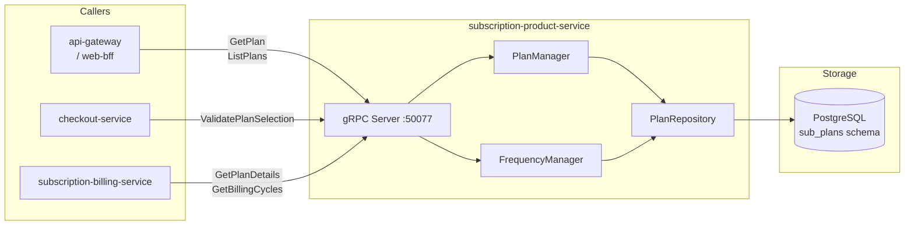

# subscription-product-service

> Subscription plans, billing cycles, and recurring product definitions.

## Overview

The subscription-product-service manages the catalog-side of recurring commerce — it defines
subscription plans (monthly/annual), billing interval options, trial periods, and the
products or services that can be subscribed to. It is the catalog layer; the actual billing
execution is handled by the subscription-billing-service in the commerce domain. The service
exposes plan details to the storefront, validates subscriptions at checkout, and maintains
the mapping between subscription plans and their associated product SKUs.

## Architecture



## Tech Stack

| Component | Technology |
|---|---|
| Language | Kotlin (Spring Boot 3, JVM 21) |
| Database | PostgreSQL |
| Protocol | gRPC |
| Port | 50077 |
| gRPC Framework | grpc-kotlin-stub + grpc-spring-boot-starter |
| DB Migrations | Flyway |
| ORM | Spring Data JPA |

## Responsibilities

- Define subscription plans with name, description, billing interval, and pricing
- Support multiple billing frequencies per plan (e.g., monthly at $9.99, annual at $99)
- Associate plans with product SKUs or service entitlements
- Define trial period duration and trial pricing
- Validate a customer's plan selection at checkout
- Expose plan comparison data for the storefront subscription selector UI
- Support plan deactivation (existing subscribers unaffected until renewal)

## API / Interface

```protobuf
service SubscriptionProductService {
  rpc CreatePlan(CreatePlanRequest) returns (CreatePlanResponse);
  rpc GetPlan(GetPlanRequest) returns (PlanResponse);
  rpc UpdatePlan(UpdatePlanRequest) returns (PlanResponse);
  rpc DeactivatePlan(DeactivatePlanRequest) returns (DeactivatePlanResponse);
  rpc ListPlans(ListPlansRequest) returns (ListPlansResponse);
  rpc ValidatePlanSelection(ValidatePlanSelectionRequest) returns (ValidatePlanSelectionResponse);
  rpc GetBillingCycles(GetBillingCyclesRequest) returns (GetBillingCyclesResponse);
}
```

| Method | Description |
|---|---|
| `CreatePlan` | Define a new subscription plan with billing options |
| `GetPlan` | Fetch plan details by ID |
| `UpdatePlan` | Modify plan description, pricing, or trial configuration |
| `DeactivatePlan` | Stop new subscriptions (existing ones run to term) |
| `ListPlans` | List active plans, optionally filtered by product/category |
| `ValidatePlanSelection` | Confirm a plan + frequency selection is valid at checkout |
| `GetBillingCycles` | Return all billing frequency options for a plan |

## Kafka Topics

Not applicable — subscription-product-service is gRPC-only (billing events are in the commerce domain).

## Dependencies

**Upstream** (calls these):
- `product-catalog-service` — validates product SKU associations on plan creation

**Downstream** (called by these):
- `checkout-service` — `ValidatePlanSelection` when a subscription is added to checkout
- `subscription-billing-service` — `GetPlanDetails` and `GetBillingCycles` for recurring billing
- `api-gateway` / `web-bff` — plan listing and detail pages

## Environment Variables

| Variable | Default | Description |
|---|---|---|
| `SPRING_DATASOURCE_URL` | — | PostgreSQL JDBC URL |
| `SPRING_DATASOURCE_USERNAME` | — | DB username |
| `SPRING_DATASOURCE_PASSWORD` | — | DB password |
| `GRPC_PORT` | `50077` | gRPC server port |
| `PRODUCT_CATALOG_SERVICE_ADDR` | `product-catalog-service:50070` | Product catalog address |

## Running Locally

```bash
docker-compose up subscription-product-service
```

## Health Check

`GET /healthz` — `{"status":"ok"}`

gRPC health protocol: `grpc.health.v1.Health/Check` on port `50077`
