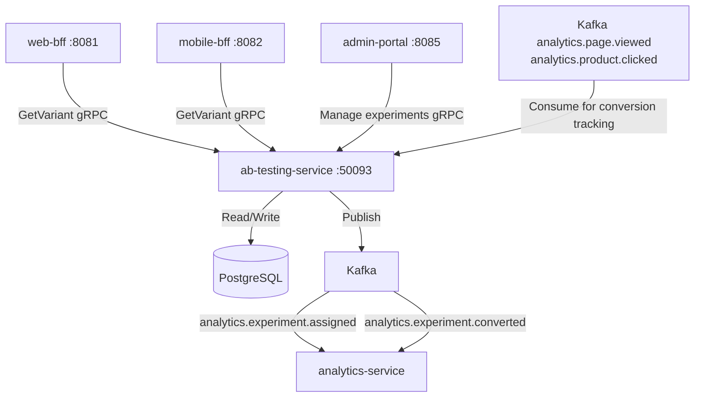

# ab-testing-service

> Manages A/B and multivariate experiment assignment, feature flags for experiments, and conversion event tracking.

## Overview

The ab-testing-service assigns users to experiment variants deterministically using consistent hashing, ensuring a user always receives the same variant across sessions. Experiments are defined with traffic allocation percentages, eligible audience segments, and conversion goal definitions. It exposes a gRPC API consumed by BFF services and stores experiment configurations and assignment records in PostgreSQL. Conversion events are tracked asynchronously.

## Architecture



## Tech Stack

| Component | Technology |
|---|---|
| Language | Go 1.23 |
| Framework | Standard library + google.golang.org/grpc |
| Database | PostgreSQL 16 |
| Migrations | golang-migrate |
| Messaging | Apache Kafka (producer + consumer) |
| Hashing | MurmurHash3 for deterministic variant assignment |
| Protocol | gRPC (port 50093) |
| Serialization | Protobuf (gRPC) + Avro (Kafka) |
| Health Check | grpc.health.v1 + HTTP /healthz |

## Responsibilities

- Deterministically assign users to experiment variants based on user ID hash bucketing
- Respect traffic allocation percentages and audience segment filters (e.g., new users only, country)
- Track assignment events for downstream statistical analysis
- Consume analytics events to record conversion signals against active experiments
- Provide experiment results with assignment counts and conversion rates for admin dashboards
- Support experiment lifecycle: draft → active → paused → concluded
- Enforce mutual exclusivity rules between conflicting experiments

## API / Interface

| Method | Request | Response | Description |
|---|---|---|---|
| `GetVariant` | `GetVariantRequest{experiment_key, user_id, context}` | `VariantResponse{variant, experiment_id}` | Get assigned variant for a user (creates assignment if new) |
| `GetAllVariants` | `GetAllVariantsRequest{user_id}` | `AllVariantsResponse{assignments[]}` | All active experiment assignments for a user |
| `TrackConversion` | `ConversionRequest{experiment_id, user_id, goal}` | `Empty` | Record a conversion event |
| `CreateExperiment` | `CreateExperimentRequest` | `Experiment` | Admin: define a new experiment |
| `UpdateExperiment` | `UpdateExperimentRequest` | `Experiment` | Admin: modify experiment settings |
| `StartExperiment` | `StartRequest{experiment_id}` | `Experiment` | Admin: activate experiment |
| `PauseExperiment` | `PauseRequest{experiment_id}` | `Experiment` | Admin: pause experiment |
| `GetResults` | `GetResultsRequest{experiment_id}` | `ExperimentResults` | Admin: current assignment and conversion stats |

Proto file: `proto/commerce/ab_testing.proto`

## Kafka Topics

Consumed:

| Topic | Purpose |
|---|---|
| `analytics.page.viewed` | Implicit conversion signal (e.g., landing page experiment) |
| `analytics.product.clicked` | Product click conversion signal |
| `commerce.order.placed` | Purchase conversion signal |

Published:

| Topic | Event Type | Trigger |
|---|---|---|
| `analytics.experiment.assigned` | `ExperimentAssignedEvent` | First-time variant assignment for a user |
| `analytics.experiment.converted` | `ExperimentConvertedEvent` | Conversion goal recorded |

## Dependencies

Upstream (callers)
- `web-bff` / `mobile-bff` — variant resolution per request
- `admin-portal` — experiment management

Downstream (Kafka → this service)
- `analytics-service` / `event-tracking-service` — conversion signal events

## Environment Variables

| Variable | Default | Description |
|---|---|---|
| `GRPC_PORT` | `50093` | gRPC listen port |
| `DB_HOST` | `postgres` | PostgreSQL hostname |
| `DB_PORT` | `5432` | PostgreSQL port |
| `DB_NAME` | `abtesting` | Database name |
| `DB_USER` | `abtesting_svc` | Database user |
| `DB_PASSWORD` | `` | Database password |
| `KAFKA_BOOTSTRAP_SERVERS` | `kafka:9092` | Kafka broker list |
| `KAFKA_GROUP_ID` | `ab-testing-service` | Kafka consumer group ID |
| `DEFAULT_SALT` | `` | Hashing salt for variant assignment (keep stable) |
| `LOG_LEVEL` | `info` | Logging level |
| `OTEL_EXPORTER_OTLP_ENDPOINT` | `` | OpenTelemetry collector endpoint |

## Running Locally

```bash
docker-compose up ab-testing-service
```

## Health Check

`GET /healthz` → `{"status":"ok"}`

gRPC health: `grpc.health.v1.Health/Check` → `SERVING`
