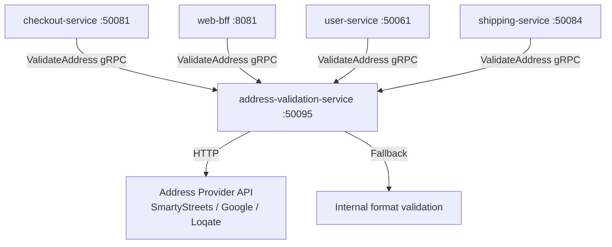

# address-validation-service

> Validates and normalises postal addresses to ensure deliverability and consistent address data across the platform.

## Overview

The address-validation-service accepts raw address input and returns a normalised, validated address using a combination of internal validation rules and optional integration with a third-party address verification provider (e.g., Google Address Validation API, SmartyStreets, or Loqate). It is a lightweight, stateless Go service with no database dependency, designed for high-throughput synchronous validation during checkout and user profile management.

## Architecture



## Tech Stack

| Component | Technology |
|---|---|
| Language | Go 1.23 |
| Framework | Standard library + google.golang.org/grpc |
| External Provider | SmartyStreets / Google Address Validation / Loqate (configurable) |
| HTTP Client | net/http with timeout and retry |
| Protocol | gRPC (port 50095) |
| Serialization | Protobuf |
| Cache | In-process LRU (address hash → result, 1-hour TTL) |
| Health Check | grpc.health.v1 + HTTP /healthz |

## Responsibilities

- Parse and validate address fields for completeness (required fields by country)
- Normalise address components: standardise abbreviations, correct postal codes, capitalise properly
- Verify deliverability with a third-party address verification provider when configured
- Return confidence scores and suggested corrections for ambiguous addresses
- Cache validated addresses to reduce external API calls for repeated inputs
- Support address validation for all countries in the configured region set
- Provide graceful degradation: fall back to format-only validation if the external provider is unavailable

## API / Interface

| Method | Request | Response | Description |
|---|---|---|---|
| `ValidateAddress` | `ValidateRequest{raw_address}` | `ValidationResult{normalised_address, valid, confidence, suggestions[]}` | Validate and normalise a single address |
| `ValidateBulk` | `ValidateBulkRequest{addresses[]}` | `ValidateBulkResponse{results[]}` | Validate multiple addresses in one call |
| `ParseAddress` | `ParseRequest{freeform_text, country}` | `ParsedAddress` | Parse a freeform address string into structured fields |

Proto file: `proto/commerce/address_validation.proto`

## Kafka Topics

The address-validation-service does not produce or consume Kafka topics.

## Dependencies

Upstream (callers)
- `checkout-service` — validates shipping and billing address before order creation
- `web-bff` / `mobile-bff` — validates addresses saved to customer profiles
- `user-service` — validates address on profile save
- `shipping-service` — validates delivery address for carrier eligibility

Downstream (called by this service)
- External address validation provider (SmartyStreets, Google, or Loqate)
- No database dependencies

## Environment Variables

| Variable | Default | Description |
|---|---|---|
| `GRPC_PORT` | `50095` | gRPC listen port |
| `ADDRESS_PROVIDER` | `internal` | Validation backend (`internal`, `smartystreets`, `google`, `loqate`) |
| `SMARTYSTREETS_AUTH_ID` | `` | SmartyStreets authentication ID |
| `SMARTYSTREETS_AUTH_TOKEN` | `` | SmartyStreets authentication token |
| `GOOGLE_API_KEY` | `` | Google Address Validation API key |
| `LOQATE_API_KEY` | `` | Loqate API key |
| `CACHE_SIZE` | `10000` | Maximum number of cached validation results |
| `CACHE_TTL_MINUTES` | `60` | Cache entry TTL in minutes |
| `PROVIDER_TIMEOUT_MS` | `3000` | External provider call timeout in milliseconds |
| `FALLBACK_ON_PROVIDER_ERROR` | `true` | Fall back to format validation if provider is unreachable |
| `LOG_LEVEL` | `info` | Logging level |
| `OTEL_EXPORTER_OTLP_ENDPOINT` | `` | OpenTelemetry collector endpoint |

## Running Locally

```bash
docker-compose up address-validation-service
```

## Health Check

`GET /healthz` → `{"status":"ok"}`

gRPC health: `grpc.health.v1.Health/Check` → `SERVING`
