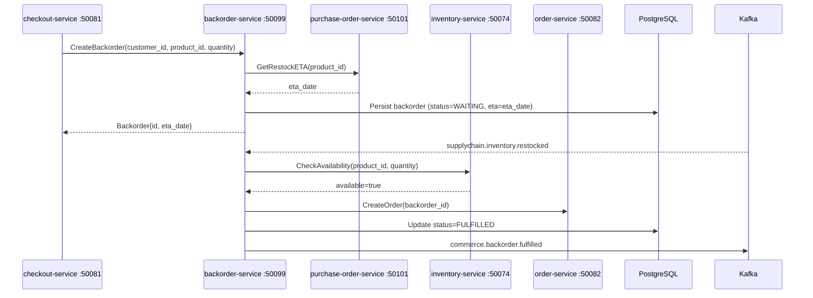

# backorder-service

> Handles orders placed when stock is zero but inbound replenishment is confirmed, auto-fulfilling on restock.

## Overview

The backorder-service allows customers to place orders against products with zero on-hand inventory when an inbound purchase order confirms future availability. It stores the backorder with an estimated fulfilment date sourced from purchase-order-service, and listens for `supplychain.inventory.restocked` Kafka events to automatically trigger order fulfilment via order-service when units arrive. This prevents lost sales on temporarily out-of-stock SKUs and gives customers transparent delivery expectations upfront.

## Architecture



## Tech Stack

| Component | Technology |
|---|---|
| Language | Go 1.24 |
| Database | PostgreSQL 16 |
| Migrations | golang-migrate |
| Messaging | Apache Kafka |
| Protocol | gRPC (port 50099) |
| Health Check | HTTP /healthz |

## Key Responsibilities

- Accept backorder requests when product stock is zero but replenishment is inbound
- Query purchase-order-service for estimated restock ETA to present to customers
- Persist backorder records with lifecycle: WAITING → ALLOCATED → FULFILLED / CANCELLED
- Consume `supplychain.inventory.restocked` events and allocate waiting backorders FIFO
- Trigger order fulfilment via order-service once stock is allocated
- Handle partial restocks by fulfilling as many queued backorders as stock allows
- Notify customers of backorder status changes via Kafka event to notification-orchestrator
- Publish `commerce.backorder.fulfilled` and `commerce.backorder.cancelled` events

## Environment Variables

| Variable | Default | Description |
|---|---|---|
| `GRPC_PORT` | `50099` | gRPC listen port |
| `DATABASE_URL` | — | PostgreSQL connection string |

## Running Locally

```bash
docker-compose up backorder-service
```

## Health Check

`GET /healthz` → `{"status":"ok"}`

gRPC health: `grpc.health.v1.Health/Check` → `SERVING`
