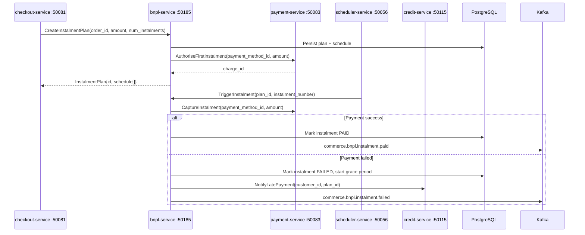

# bnpl-service

> Buy Now Pay Later — manages instalment plans, payment schedules, and deferred payment processing.

## Overview

The bnpl-service enables customers to split a purchase into a series of scheduled instalments with zero or low interest rates. At checkout, it generates an instalment plan, records the full order amount as a liability in PostgreSQL, and defers actual payment captures to future scheduled dates. The scheduler-service triggers instalment collection events, which bnpl-service handles by instructing payment-service to charge the customer's saved payment method. Late payments trigger grace-period logic and escalate to credit-service if unresolved.

## Architecture



## Tech Stack

| Component | Technology |
|---|---|
| Language | Go 1.24 |
| Database | PostgreSQL 16 |
| Migrations | golang-migrate |
| Messaging | Apache Kafka |
| Protocol | gRPC (port 50185) |
| Health Check | HTTP /healthz |

## Key Responsibilities

- Generate instalment plans with configurable number of instalments and interval (weekly/monthly)
- Authorise the first instalment at checkout time; defer subsequent captures to scheduled dates
- Persist instalment schedule with per-instalment status: PENDING, PAID, FAILED, FORGIVEN
- Process scheduled instalment captures triggered by scheduler-service
- Implement grace-period logic before escalating failed payments to credit-service
- Support early full repayment at any point in the plan lifecycle
- Publish instalment lifecycle Kafka events for notifications and financial reconciliation
- Provide plan summary and payment history via gRPC for customer account views

## Environment Variables

| Variable | Default | Description |
|---|---|---|
| `GRPC_PORT` | `50185` | gRPC listen port |
| `DATABASE_URL` | — | PostgreSQL connection string |

## Running Locally

```bash
docker-compose up bnpl-service
```

## Health Check

`GET /healthz` → `{"status":"ok"}`

gRPC health: `grpc.health.v1.Health/Check` → `SERVING`
