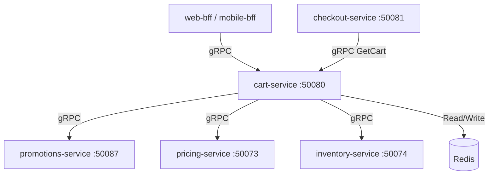

# cart-service

> Manages shopping cart lifecycle — add, update, and remove items with real-time promotion application.

## Overview

The cart-service is a stateless, high-throughput service that stores cart state in Redis for low-latency reads and writes. It applies cart-level promotions sourced from the promotions-service and exposes a gRPC API consumed by the BFF layer and the checkout-service. Cart data is keyed by session or user ID and carries a configurable TTL.

## Architecture



## Tech Stack

| Component | Technology |
|---|---|
| Language | C# / .NET 9 |
| Framework | ASP.NET Core + Grpc.AspNetCore |
| Cache | Redis 7 |
| Protocol | gRPC (port 50080) |
| Serialization | Protobuf |
| Health Check | grpc.health.v1 + HTTP /healthz |

## Responsibilities

- Store and retrieve cart items keyed by `cart_id` (anonymous) or `user_id` (authenticated)
- Add, update quantity, and remove line items
- Apply cart-level promotions and discount codes supplied by promotions-service
- Fetch real-time prices from pricing-service and validate stock availability against inventory-service
- Enforce cart TTL (default 7 days) and merge anonymous carts on user login
- Provide a read-only `GetCart` snapshot for checkout-service during checkout initiation

## API / Interface

| Method | Request | Response | Description |
|---|---|---|---|
| `GetCart` | `GetCartRequest` | `Cart` | Retrieve current cart with computed totals |
| `AddItem` | `AddItemRequest` | `Cart` | Add a product SKU with quantity |
| `UpdateItem` | `UpdateItemRequest` | `Cart` | Change quantity of an existing line item |
| `RemoveItem` | `RemoveItemRequest` | `Cart` | Remove a line item by SKU |
| `ApplyCoupon` | `ApplyCouponRequest` | `Cart` | Apply a promotion/coupon code |
| `RemoveCoupon` | `RemoveCouponRequest` | `Cart` | Remove an applied coupon |
| `ClearCart` | `ClearCartRequest` | `Empty` | Empty the cart (post-checkout) |
| `MergeCart` | `MergeCartRequest` | `Cart` | Merge anonymous cart into authenticated user cart |

Proto file: `proto/commerce/cart.proto`

## Kafka Topics

The cart-service publishes the following topic for analytics:

| Topic | Trigger |
|---|---|
| `commerce.cart.abandoned` | Published by a background job when a cart with items has not been updated for 24 hours |

## Dependencies

Upstream (callers)
- `web-bff` / `mobile-bff` — primary consumers via gRPC
- `checkout-service` — calls `GetCart` to initiate checkout

Downstream (called by this service)
- `promotions-service` — validate and apply coupon codes / auto-promotions
- `pricing-service` — resolve current prices per SKU
- `inventory-service` — soft-check stock availability before add-to-cart

## Environment Variables

| Variable | Default | Description |
|---|---|---|
| `REDIS_HOST` | `redis` | Redis hostname |
| `REDIS_PORT` | `6379` | Redis port |
| `REDIS_PASSWORD` | `` | Redis auth password (empty = no auth) |
| `REDIS_DB` | `0` | Redis database index |
| `CART_TTL_DAYS` | `7` | Cart expiry in days |
| `GRPC_PORT` | `50080` | gRPC listen port |
| `PROMOTIONS_SERVICE_ADDR` | `promotions-service:50087` | Promotions service address |
| `PRICING_SERVICE_ADDR` | `pricing-service:50073` | Pricing service address |
| `INVENTORY_SERVICE_ADDR` | `inventory-service:50074` | Inventory service address |
| `LOG_LEVEL` | `Information` | Logging level |
| `OTEL_EXPORTER_OTLP_ENDPOINT` | `` | OpenTelemetry collector endpoint |

## Running Locally

```bash
docker-compose up cart-service
```

To run in isolation with dependencies mocked:

```bash
cd src/commerce/cart-service
dotnet run
```

## Health Check

`GET /healthz` → `{"status":"ok"}`

gRPC health: `grpc.health.v1.Health/Check` → `SERVING`
