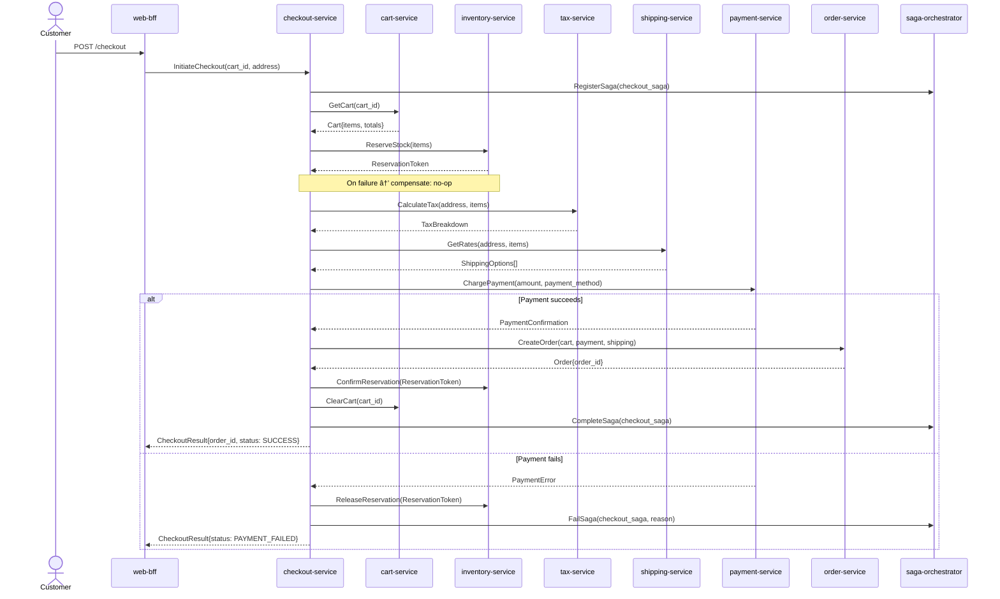

# checkout-service

> Orchestrates the end-to-end checkout saga — from cart validation through inventory reservation, payment, and order creation.

## Overview

The checkout-service is the central saga orchestrator for the purchase flow. It coordinates a sequence of distributed steps across multiple services: validating the cart, reserving inventory, calculating tax and shipping, processing payment, and finally creating the order. Each step is compensated on failure to maintain consistency without distributed transactions. The service is stateless at the API layer; saga state is persisted in the saga-orchestrator.

## Architecture



## Tech Stack

| Component | Technology |
|---|---|
| Language | Go 1.23 |
| Framework | Standard library + google.golang.org/grpc |
| Protocol | gRPC (port 50081) |
| Saga State | saga-orchestrator (external) |
| Serialization | Protobuf |
| Health Check | grpc.health.v1 + HTTP /healthz |

## Responsibilities

- Validate cart contents are non-empty and all SKUs are still active
- Reserve inventory to prevent overselling during checkout window
- Assemble tax and shipping cost estimates before payment
- Invoke payment-service with idempotency key derived from checkout session
- Create the canonical order record via order-service on payment success
- Compensate all prior steps on any downstream failure (saga rollback)
- Enforce checkout session timeout (default 15 minutes)

## API / Interface

| Method | Request | Response | Description |
|---|---|---|---|
| `InitiateCheckout` | `InitiateCheckoutRequest` | `CheckoutSession` | Begin checkout, returns session with tax/shipping options |
| `ConfirmCheckout` | `ConfirmCheckoutRequest` | `CheckoutResult` | Confirm shipping selection and payment method, execute saga |
| `GetCheckoutSession` | `GetSessionRequest` | `CheckoutSession` | Retrieve current session state |
| `AbandonCheckout` | `AbandonCheckoutRequest` | `Empty` | Cancel checkout and release reservations |

Proto file: `proto/commerce/checkout.proto`

## Kafka Topics

The checkout-service does not publish Kafka events directly. Order and payment events are emitted by order-service and payment-service respectively as part of the saga.

## Dependencies

Upstream (callers)
- `web-bff` / `mobile-bff` — initiates and confirms checkout

Downstream (called by this service)
- `cart-service` — fetch cart contents
- `inventory-service` — reserve and release/confirm stock
- `tax-service` — compute applicable taxes
- `shipping-service` — retrieve carrier rates
- `payment-service` — charge the customer
- `order-service` — create the persisted order record
- `saga-orchestrator` — register, track, and compensate saga steps
- `address-validation-service` — validate shipping address before reservation

## Environment Variables

| Variable | Default | Description |
|---|---|---|
| `GRPC_PORT` | `50081` | gRPC listen port |
| `CART_SERVICE_ADDR` | `cart-service:50080` | Cart service address |
| `INVENTORY_SERVICE_ADDR` | `inventory-service:50074` | Inventory service address |
| `TAX_SERVICE_ADDR` | `tax-service:50086` | Tax service address |
| `SHIPPING_SERVICE_ADDR` | `shipping-service:50084` | Shipping service address |
| `PAYMENT_SERVICE_ADDR` | `payment-service:50083` | Payment service address |
| `ORDER_SERVICE_ADDR` | `order-service:50082` | Order service address |
| `SAGA_ORCHESTRATOR_ADDR` | `saga-orchestrator:50054` | Saga orchestrator address |
| `ADDRESS_VALIDATION_ADDR` | `address-validation-service:50095` | Address validation service address |
| `CHECKOUT_SESSION_TTL_MINUTES` | `15` | Checkout session expiry |
| `LOG_LEVEL` | `info` | Logging level |
| `OTEL_EXPORTER_OTLP_ENDPOINT` | `` | OpenTelemetry collector endpoint |

## Running Locally

```bash
docker-compose up checkout-service
```

## Health Check

`GET /healthz` → `{"status":"ok"}`

gRPC health: `grpc.health.v1.Health/Check` → `SERVING`
