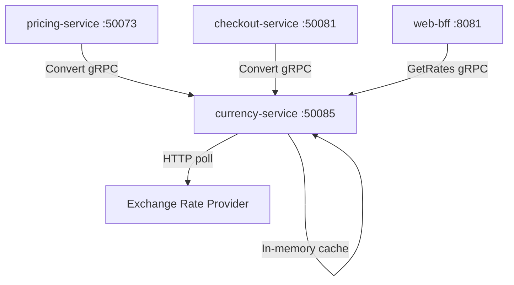

# currency-service

> Provides real-time currency exchange rates and multi-currency conversion for the ShopOS platform.

## Overview

The currency-service is a lightweight, stateless Node.js service that fetches exchange rates from an external provider (e.g., Open Exchange Rates or European Central Bank), caches them in memory with a short TTL, and exposes a gRPC API for on-demand currency conversion. It is consumed by pricing-service, checkout-service, and any BFF layer that needs to display prices in the customer's local currency.

## Architecture



## Tech Stack

| Component | Technology |
|---|---|
| Language | Node.js 20 (LTS) |
| Framework | @grpc/grpc-js + @grpc/proto-loader |
| Rate Cache | In-process LRU cache (15-minute TTL) |
| HTTP Client | node-fetch / axios |
| Protocol | gRPC (port 50085) |
| Serialization | Protobuf |
| Health Check | grpc.health.v1 + HTTP /healthz |

## Responsibilities

- Fetch and cache foreign exchange rates from a configurable external provider
- Perform currency conversion for arbitrary source/target currency pairs
- Support bulk conversion of a price list in one RPC call
- Expose the full rates table for a given base currency
- Refresh the rate cache on a configurable polling interval (default 15 minutes)
- Gracefully degrade by serving stale cached rates if the provider is unreachable

## API / Interface

| Method | Request | Response | Description |
|---|---|---|---|
| `Convert` | `ConvertRequest{amount, from, to}` | `ConvertResponse{converted_amount, rate}` | Convert a single monetary amount |
| `ConvertBulk` | `ConvertBulkRequest{amounts[], from, to}` | `ConvertBulkResponse{results[]}` | Convert multiple amounts in one call |
| `GetRates` | `GetRatesRequest{base_currency}` | `GetRatesResponse{rates{}}` | Retrieve all exchange rates for a base currency |
| `GetSupportedCurrencies` | `Empty` | `CurrenciesResponse{codes[]}` | List all supported ISO 4217 currency codes |

Proto file: `proto/commerce/currency.proto`

## Kafka Topics

The currency-service does not produce or consume Kafka topics.

## Dependencies

**Upstream (callers)**
- `pricing-service` — converts catalog prices to display currencies
- `checkout-service` — converts cart totals for multi-currency checkout
- `web-bff` / `mobile-bff` — storefront currency display
- `invoice-service` — invoice currency conversion

**Downstream (called by this service)**
- External exchange rate API (Open Exchange Rates, ECB, or Fixer.io)

## Environment Variables

| Variable | Default | Description |
|---|---|---|
| `GRPC_PORT` | `50085` | gRPC listen port |
| `RATE_PROVIDER` | `openexchangerates` | Exchange rate provider (`openexchangerates`, `ecb`, `fixer`) |
| `OPENEXCHANGERATES_APP_ID` | `` | Open Exchange Rates application ID |
| `FIXER_API_KEY` | `` | Fixer.io API key |
| `BASE_CURRENCY` | `USD` | Default base currency for rate table |
| `CACHE_TTL_MINUTES` | `15` | In-memory cache TTL in minutes |
| `RATE_REFRESH_INTERVAL_MINUTES` | `15` | Background rate refresh interval |
| `STALE_RATE_MAX_AGE_HOURS` | `2` | Max age of stale rates served on provider outage |
| `LOG_LEVEL` | `info` | Logging level |
| `OTEL_EXPORTER_OTLP_ENDPOINT` | `` | OpenTelemetry collector endpoint |

## Running Locally

```bash
docker-compose up currency-service
```

## Health Check

`GET /healthz` → `{"status":"ok"}`

gRPC health: `grpc.health.v1.Health/Check` → `SERVING`
