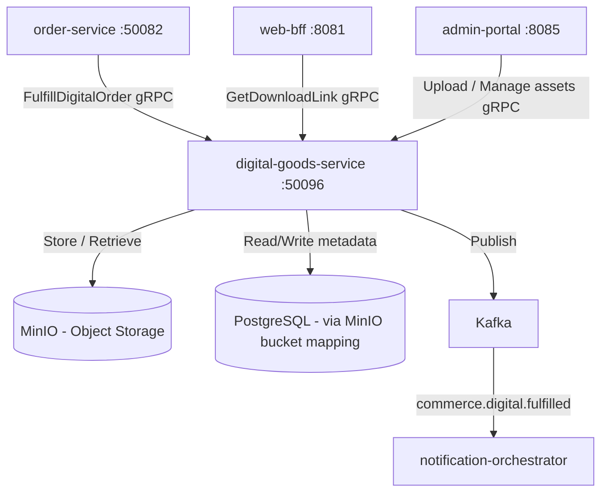

# digital-goods-service

> Delivers digital products to customers via time-limited download links and manages software license key issuance.

## Overview

The digital-goods-service handles post-purchase fulfilment of digital products: e-books, software, music, video files, and license-gated content. It stores binary assets in MinIO (S3-compatible object storage) and generates pre-signed, time-limited download URLs that are served to customers post-payment. For software products, it also manages license key pools — either pre-generated or dynamically generated — and associates keys with customer purchases.

## Architecture



## Tech Stack

| Component | Technology |
|---|---|
| Language | Go 1.23 |
| Framework | Standard library + google.golang.org/grpc |
| Object Storage | MinIO (S3-compatible) |
| Pre-signed URLs | MinIO Go SDK presigned URL generation |
| Metadata Store | MinIO object metadata + in-memory index |
| Messaging | Apache Kafka |
| Protocol | gRPC (port 50096) |
| Serialization | Protobuf (gRPC) + Avro (Kafka) |
| Health Check | grpc.health.v1 + HTTP /healthz |

## Responsibilities

- Store digital product assets in MinIO with product-scoped bucket organisation
- Generate pre-signed, expiring download URLs upon valid purchase verification
- Enforce download limits per purchase (configurable maximum download count)
- Issue license keys from pre-loaded key pools or via dynamic key generation
- Associate license keys with specific customer order line items
- Provide download history per customer per product for support queries
- Revoke download access and license keys on refund or chargeback
- Notify customers of download availability via notification-orchestrator

## API / Interface

| Method | Request | Response | Description |
|---|---|---|---|
| `FulfillDigitalOrder` | `FulfillRequest{order_id, customer_id, items[]}` | `FulfillmentResult{download_links[], license_keys[]}` | Fulfil digital goods for a completed order |
| `GetDownloadLink` | `DownloadLinkRequest{order_item_id, customer_id}` | `DownloadLink{url, expires_at, downloads_remaining}` | Generate a fresh pre-signed download URL |
| `GetLicenseKey` | `LicenseKeyRequest{order_item_id, customer_id}` | `LicenseKey{key, activations_allowed, activations_used}` | Retrieve issued license key |
| `UploadAsset` | `UploadAssetRequest{product_id, file_name, content_type}` | `UploadURL{presigned_upload_url}` | Admin: get a presigned URL for asset upload |
| `ListPurchasedGoods` | `ListRequest{customer_id}` | `ListGoodsResponse{items[]}` | Customer: list all digital goods with access |
| `RevokeAccess` | `RevokeRequest{order_item_id, reason}` | `Empty` | Admin: revoke download and license access |

Proto file: `proto/commerce/digital_goods.proto`

## Kafka Topics

| Topic | Event Type | Trigger |
|---|---|---|
| `commerce.digital.fulfilled` | `DigitalFulfilledEvent` | Download links and/or license keys generated after order completion |

## Dependencies

**Upstream (callers)**
- `order-service` — triggers fulfilment when an order containing digital goods is confirmed
- `web-bff` / `mobile-bff` — customer download portal
- `admin-portal` — asset management and key pool management
- `return-refund-service` — revoke access on approved refund

**Downstream (called by this service)**
- MinIO — binary asset storage and pre-signed URL generation
- Kafka — `commerce.digital.fulfilled` event for customer notification

## Environment Variables

| Variable | Default | Description |
|---|---|---|
| `GRPC_PORT` | `50096` | gRPC listen port |
| `MINIO_ENDPOINT` | `minio:9000` | MinIO server endpoint |
| `MINIO_ACCESS_KEY` | `` | MinIO access key |
| `MINIO_SECRET_KEY` | `` | MinIO secret key |
| `MINIO_USE_SSL` | `false` | Use TLS for MinIO connection |
| `MINIO_BUCKET_PREFIX` | `digital-goods` | Prefix for product asset buckets |
| `DOWNLOAD_LINK_TTL_HOURS` | `24` | Pre-signed URL expiry in hours |
| `MAX_DOWNLOADS_PER_PURCHASE` | `5` | Maximum download attempts per purchase |
| `KAFKA_BOOTSTRAP_SERVERS` | `kafka:9092` | Kafka broker list |
| `LOG_LEVEL` | `info` | Logging level |
| `OTEL_EXPORTER_OTLP_ENDPOINT` | `` | OpenTelemetry collector endpoint |

## Running Locally

```bash
docker-compose up digital-goods-service
```

## Health Check

`GET /healthz` → `{"status":"ok"}`

gRPC health: `grpc.health.v1.Health/Check` → `SERVING`
