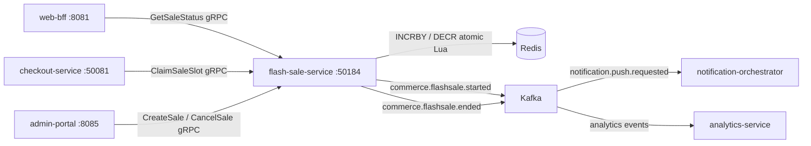

# flash-sale-service

> Manages time-boxed flash sales with countdown timers, per-customer purchase limits, and atomic stock decrement.

## Overview

The flash-sale-service orchestrates limited-time promotional sales events where specific products are offered at discounted prices for a fixed duration with a capped total quantity. All high-contention operations — stock decrement, per-customer purchase counters, and sale state transitions — are executed as atomic Redis Lua scripts to prevent overselling under burst traffic. The service exposes sale state (scheduled, active, ended) and remaining stock to frontend clients in sub-millisecond reads from Redis.

## Architecture



## Tech Stack

| Component | Technology |
|---|---|
| Language | Go 1.24 |
| Database | Redis 7 (atomic Lua scripts, sorted sets, TTL keys) |
| Messaging | Apache Kafka |
| Protocol | gRPC (port 50184) |
| Health Check | HTTP /healthz |

## Key Responsibilities

- Schedule flash sales with start time, end time, discounted price, and total unit cap
- Transition sale state (SCHEDULED → ACTIVE → ENDED) driven by countdown timers
- Atomically decrement stock counter and enforce per-customer purchase limits via Redis Lua
- Expose real-time remaining stock and countdown TTL to frontends via GetSaleStatus RPC
- Reject purchase attempts after sale end or when stock is exhausted
- Publish `commerce.flashsale.started` and `commerce.flashsale.ended` Kafka events for notifications and analytics
- Support sale cancellation by admin with automatic stock release

## Environment Variables

| Variable | Default | Description |
|---|---|---|
| `GRPC_PORT` | `50184` | gRPC listen port |
| `REDIS_URL` | — | Redis connection URL |

## Running Locally

```bash
docker-compose up flash-sale-service
```

## Health Check

`GET /healthz` → `{"status":"ok"}`

gRPC health: `grpc.health.v1.Health/Check` → `SERVING`
