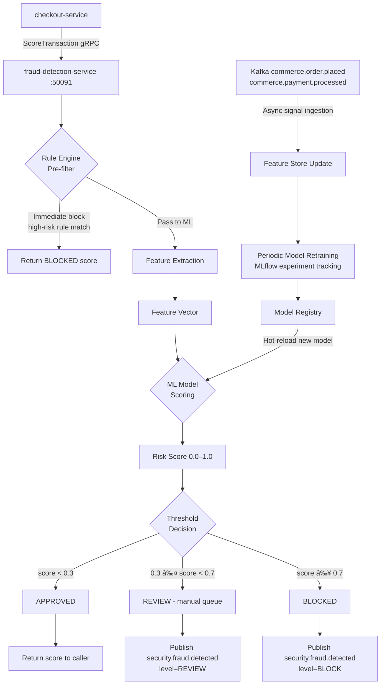

# fraud-detection-service

> ML-based real-time fraud scoring for orders and payment attempts, with rule-based fallback and automatic model retraining.

## Overview

The fraud-detection-service applies a machine learning model to score transactions for fraud risk at checkout time. Scores are computed synchronously via gRPC for low-latency integration with checkout-service. Asynchronously, all transaction signals are consumed from Kafka for model feature enrichment and periodic retraining. When fraud is detected above a configurable threshold, the service publishes `security.fraud.detected` which triggers downstream review or automatic block workflows.

## Architecture



## Tech Stack

| Component | Technology |
|---|---|
| Language | Python 3.12 |
| Framework | grpcio + grpcio-tools |
| ML Framework | scikit-learn / XGBoost |
| Model Serving | In-process with joblib model loading |
| Model Registry | MLflow |
| Database | PostgreSQL 16 (signals + model metadata) |
| Messaging | Apache Kafka (consumer + producer) |
| Protocol | gRPC (port 50091) + Kafka |
| Serialization | Protobuf (gRPC) + Avro (Kafka) |
| Health Check | grpc.health.v1 + HTTP /healthz |

## Responsibilities

- Score transaction requests synchronously in under 50ms p99
- Apply rule-based pre-filters for known fraud patterns before ML scoring
- Extract real-time features: velocity checks, geolocation anomalies, device fingerprint, order value deviation
- Load and hot-reload the trained fraud model from MLflow model registry
- Persist all scored transactions with feature vectors for model retraining
- Consume order and payment events from Kafka to enrich the feature store
- Publish `security.fraud.detected` when score exceeds configurable thresholds
- Expose manual review outcome API for supervised learning feedback loop

## API / Interface

| Method | Request | Response | Description |
|---|---|---|---|
| `ScoreTransaction` | `ScoreRequest{order_id, customer_id, amount, payment_method, device_fingerprint, ip_address, shipping_address}` | `ScoreResponse{score, decision, reasons[]}` | Real-time fraud score for a transaction |
| `ReportOutcome` | `OutcomeRequest{transaction_id, outcome}` | `Empty` | Feed manual review outcome back to training data |
| `GetTransactionScore` | `GetScoreRequest{transaction_id}` | `ScoreRecord` | Retrieve historical score for a transaction |

Proto file: `proto/commerce/fraud_detection.proto`

## Kafka Topics

Consumed:

| Topic | Purpose |
|---|---|
| `commerce.order.placed` | Enrich order velocity features |
| `commerce.payment.processed` | Confirmed payment signals |
| `commerce.payment.failed` | Failed payment signals (card testing indicator) |

Published:

| Topic | Event Type | Trigger |
|---|---|---|
| `security.fraud.detected` | `FraudDetectedEvent` | Score at or above review/block threshold |

## Dependencies

Upstream (callers)
- `checkout-service` — synchronous fraud score before payment attempt

Downstream (called by this service)
- MLflow — model registry for versioned model loading
- PostgreSQL — transaction signal storage
- `device-fingerprint-service` (optional enrichment)

Kafka consumers of published events
- `payment-service` — can block payment on `BLOCK` decision
- `support-ticket-service` — auto-creates fraud review ticket on `REVIEW`
- `audit-service` — records all fraud signals

## Environment Variables

| Variable | Default | Description |
|---|---|---|
| `GRPC_PORT` | `50091` | gRPC listen port |
| `DB_HOST` | `postgres` | PostgreSQL hostname |
| `DB_PORT` | `5432` | PostgreSQL port |
| `DB_NAME` | `fraud` | Database name |
| `DB_USER` | `fraud_svc` | Database user |
| `DB_PASSWORD` | `` | Database password |
| `KAFKA_BOOTSTRAP_SERVERS` | `kafka:9092` | Kafka broker list |
| `KAFKA_GROUP_ID` | `fraud-detection-service` | Kafka consumer group ID |
| `MLFLOW_TRACKING_URI` | `http://mlflow:5000` | MLflow tracking server URL |
| `MODEL_NAME` | `fraud_scorer` | Registered model name in MLflow |
| `MODEL_STAGE` | `Production` | MLflow model stage to load |
| `SCORE_THRESHOLD_REVIEW` | `0.3` | Score above which transaction is flagged for review |
| `SCORE_THRESHOLD_BLOCK` | `0.7` | Score above which transaction is blocked |
| `MODEL_RELOAD_INTERVAL_MINUTES` | `60` | How often to check for new model versions |
| `LOG_LEVEL` | `INFO` | Logging level |
| `OTEL_EXPORTER_OTLP_ENDPOINT` | `` | OpenTelemetry collector endpoint |

## Running Locally

```bash
docker-compose up fraud-detection-service
```

## Health Check

`GET /healthz` → `{"status":"ok"}`

gRPC health: `grpc.health.v1.Health/Check` → `SERVING`
