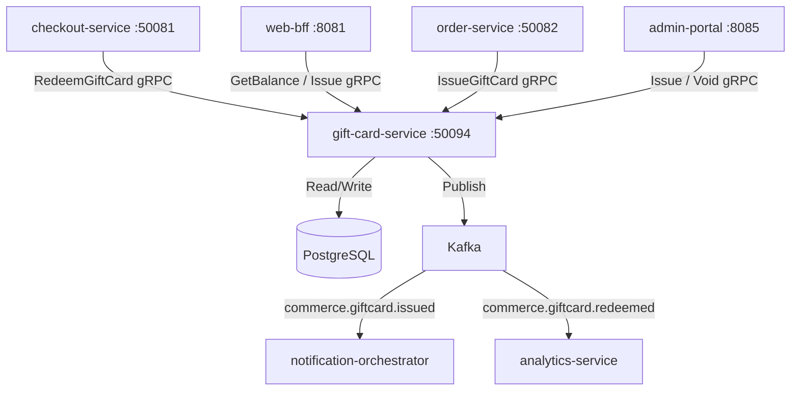

# gift-card-service

> Issues, validates, and tracks redemptions of digital gift cards with balance management.

## Overview

The gift-card-service handles the full lifecycle of digital gift cards in ShopOS: issuance (purchased or promotional), secure code generation, balance management, and redemption at checkout. Gift card codes are cryptographically generated, stored hashed in PostgreSQL, and validated with constant-time comparison to prevent timing attacks. A single gift card can be partially redeemed across multiple orders until its balance is exhausted.

## Architecture



## Tech Stack

| Component | Technology |
|---|---|
| Language | Go 1.23 |
| Framework | Standard library + google.golang.org/grpc |
| Database | PostgreSQL 16 |
| Migrations | golang-migrate |
| Messaging | Apache Kafka |
| Code Generation | crypto/rand (CSPRNG) |
| Protocol | gRPC (port 50094) |
| Serialization | Protobuf (gRPC) + Avro (Kafka) |
| Health Check | grpc.health.v1 + HTTP /healthz |

## Responsibilities

- Generate cryptographically secure, unique gift card codes
- Store card codes as salted hashes; never expose raw codes after initial issuance
- Track individual gift card balances with full redemption history
- Process partial redemptions, updating the remaining balance atomically
- Support gift card expiration dates and enforce them at redemption
- Allow admin voiding of gift cards (e.g., fraudulent purchase)
- Send the gift card code to the recipient via notification-orchestrator
- Publish issuance and redemption events for financial reconciliation

## API / Interface

| Method | Request | Response | Description |
|---|---|---|---|
| `IssueGiftCard` | `IssueRequest{amount, currency, recipient_email, expiry_date?}` | `GiftCard{code, balance}` | Create and issue a new gift card |
| `GetBalance` | `GetBalanceRequest{code}` | `GiftCardBalance{balance, currency, expires_at, status}` | Check remaining balance |
| `RedeemGiftCard` | `RedeemRequest{code, amount, order_id, idempotency_key}` | `RedemptionResult{redeemed, remaining_balance}` | Partially or fully redeem a gift card |
| `VoidGiftCard` | `VoidRequest{code, reason}` | `GiftCard` | Admin: void a gift card |
| `GetGiftCard` | `GetGiftCardRequest{card_id}` | `GiftCard` | Admin: retrieve card details by internal ID |
| `ListRedemptions` | `ListRedemptionsRequest{card_id}` | `ListRedemptionsResponse` | Full redemption history for a card |

Proto file: `proto/commerce/gift_card.proto`

## Kafka Topics

| Topic | Event Type | Trigger |
|---|---|---|
| `commerce.giftcard.issued` | `GiftCardIssuedEvent` | New gift card created and sent |
| `commerce.giftcard.redeemed` | `GiftCardRedeemedEvent` | Redemption applied to an order |
| `commerce.giftcard.exhausted` | `GiftCardExhaustedEvent` | Gift card balance reaches zero |

## Dependencies

Upstream (callers)
- `checkout-service` — apply gift card as a payment method
- `order-service` — issue gift cards purchased as products
- `web-bff` — balance checks and customer-facing issuance
- `admin-portal` — bulk issuance and voiding

Downstream (Kafka consumers of gift card events)
- `notification-orchestrator` — delivers gift card code to recipient via email
- `analytics-service` — gift card usage analytics
- `reconciliation-service` — financial liability tracking

## Environment Variables

| Variable | Default | Description |
|---|---|---|
| `GRPC_PORT` | `50094` | gRPC listen port |
| `DB_HOST` | `postgres` | PostgreSQL hostname |
| `DB_PORT` | `5432` | PostgreSQL port |
| `DB_NAME` | `giftcards` | Database name |
| `DB_USER` | `giftcard_svc` | Database user |
| `DB_PASSWORD` | `` | Database password |
| `KAFKA_BOOTSTRAP_SERVERS` | `kafka:9092` | Kafka broker list |
| `CODE_LENGTH` | `16` | Length of generated gift card code (characters) |
| `CODE_FORMAT` | `XXXX-XXXX-XXXX-XXXX` | Display format mask for gift card codes |
| `DEFAULT_EXPIRY_MONTHS` | `24` | Default validity period from issuance |
| `LOG_LEVEL` | `info` | Logging level |
| `OTEL_EXPORTER_OTLP_ENDPOINT` | `` | OpenTelemetry collector endpoint |

## Running Locally

```bash
docker-compose up gift-card-service
```

## Health Check

`GET /healthz` → `{"status":"ok"}`

gRPC health: `grpc.health.v1.Health/Check` → `SERVING`
