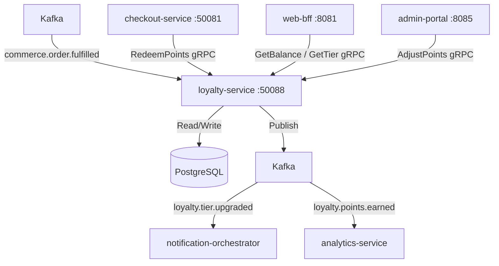

# loyalty-service

> Manages loyalty points earning, redemption, and tiered membership for ShopOS customers.

## Overview

The loyalty-service tracks every customer's points balance, processes earn events triggered by completed orders, and handles point redemption during checkout. It implements a configurable tier model (Bronze, Silver, Gold, Platinum) where tier upgrades and downgrades are computed periodically based on rolling spend. The service is backed by PostgreSQL and exposes a gRPC API.

## Architecture



## Tech Stack

| Component | Technology |
|---|---|
| Language | Go 1.23 |
| Framework | Standard library + google.golang.org/grpc |
| Database | PostgreSQL 16 |
| Migrations | golang-migrate |
| Messaging | Apache Kafka (consumer + producer) |
| Protocol | gRPC (port 50088) |
| Serialization | Protobuf (gRPC) + Avro (Kafka) |
| Health Check | grpc.health.v1 + HTTP /healthz |

## Responsibilities

- Award points to customers when an order is fulfilled (consume `commerce.order.fulfilled`)
- Apply configurable earn rates per customer tier and product category
- Process point redemption requests during checkout (1 point = configurable monetary value)
- Enforce minimum redemption thresholds and maximum redemption percentages per order
- Calculate and update customer tier based on rolling 12-month spend
- Publish tier upgrade/downgrade events for downstream notifications
- Handle point expiration after configurable inactivity window
- Provide point transaction history for customer account pages

## API / Interface

| Method | Request | Response | Description |
|---|---|---|---|
| `GetBalance` | `GetBalanceRequest{customer_id}` | `Balance{points, tier, expiry_date}` | Get current points balance and tier |
| `RedeemPoints` | `RedeemRequest{customer_id, points, order_id}` | `RedemptionResult{redeemed, monetary_value}` | Redeem points against an order |
| `GetTransactionHistory` | `HistoryRequest{customer_id, page, page_size}` | `HistoryResponse{transactions[]}` | Paginated points transaction log |
| `GetTierBenefits` | `TierRequest{tier}` | `TierBenefits{earn_rate, perks[]}` | Describe benefits for a given tier |
| `AdjustPoints` | `AdjustRequest{customer_id, delta, reason}` | `Balance` | Admin: manual points adjustment |
| `ListTiers` | `Empty` | `TiersResponse{tiers[]}` | List all tier definitions |

Proto file: `proto/commerce/loyalty.proto`

## Kafka Topics

Consumed:

| Topic | Action |
|---|---|
| `commerce.order.fulfilled` | Earn points for the completed order |

Published:

| Topic | Event Type | Trigger |
|---|---|---|
| `loyalty.points.earned` | `PointsEarnedEvent` | Points credited to customer account |
| `loyalty.tier.upgraded` | `TierUpgradedEvent` | Customer advances to next tier |
| `loyalty.tier.downgraded` | `TierDowngradedEvent` | Customer drops to lower tier |

## Dependencies

Upstream (callers)
- `checkout-service` — point redemption during checkout
- `web-bff` / `mobile-bff` — balance and history display
- `admin-portal` — manual adjustments

Downstream (Kafka → this service)
- `order-service` via `commerce.order.fulfilled` — triggers point earning

This service publishes to:
- `notification-orchestrator` — tier change notifications
- `analytics-service` — loyalty engagement metrics

## Environment Variables

| Variable | Default | Description |
|---|---|---|
| `GRPC_PORT` | `50088` | gRPC listen port |
| `DB_HOST` | `postgres` | PostgreSQL hostname |
| `DB_PORT` | `5432` | PostgreSQL port |
| `DB_NAME` | `loyalty` | Database name |
| `DB_USER` | `loyalty_svc` | Database user |
| `DB_PASSWORD` | `` | Database password |
| `KAFKA_BOOTSTRAP_SERVERS` | `kafka:9092` | Kafka broker list |
| `KAFKA_GROUP_ID` | `loyalty-service` | Kafka consumer group ID |
| `POINTS_PER_DOLLAR` | `10` | Default earn rate (points per currency unit) |
| `POINTS_EXPIRY_MONTHS` | `24` | Months of inactivity before points expire |
| `MIN_REDEMPTION_POINTS` | `500` | Minimum points required for redemption |
| `MAX_REDEMPTION_PCT` | `50` | Max percentage of order value payable by points |
| `TIER_REVIEW_CRON` | `0 0 1 * *` | Cron schedule for monthly tier recalculation |
| `LOG_LEVEL` | `info` | Logging level |
| `OTEL_EXPORTER_OTLP_ENDPOINT` | `` | OpenTelemetry collector endpoint |

## Running Locally

```bash
docker-compose up loyalty-service
```

## Health Check

`GET /healthz` → `{"status":"ok"}`

gRPC health: `grpc.health.v1.Health/Check` → `SERVING`
