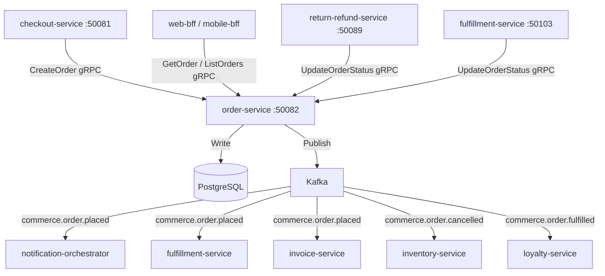

# order-service

> Manages the full order lifecycle from creation through fulfilment, serving as the system of record for all customer orders.

## Overview

The order-service owns the canonical order entity and drives it through its state machine: `created → confirmed → processing → shipped → delivered` (with `cancelled` and `return_requested` as terminal side states). It is a Kotlin/Spring Boot service backed by PostgreSQL with full audit history via event sourcing patterns. It publishes domain events to Kafka that trigger downstream workflows in communications, supply-chain, and financial domains.

## Architecture



## Tech Stack

| Component | Technology |
|---|---|
| Language | Kotlin 1.9 |
| Framework | Spring Boot 3 + Spring gRPC |
| Database | PostgreSQL 16 |
| Migrations | Flyway |
| Messaging | Apache Kafka |
| Protocol | gRPC (port 50082) |
| Serialization | Protobuf (gRPC) + Avro (Kafka) |
| Health Check | grpc.health.v1 + HTTP /healthz |

## Responsibilities

- Create and persist order records with full line-item detail
- Enforce order state machine transitions and reject invalid state changes
- Publish lifecycle events to Kafka for downstream domain reactions
- Provide read APIs for customer order history and order detail
- Support admin operations: manual status override, order notes
- Maintain an append-only order event log for audit and replay
- Expose aggregate order metrics per customer for loyalty-service

## API / Interface

| Method | Request | Response | Description |
|---|---|---|---|
| `CreateOrder` | `CreateOrderRequest` | `Order` | Create a new order (called by checkout-service) |
| `GetOrder` | `GetOrderRequest` | `Order` | Retrieve a single order by ID |
| `ListOrders` | `ListOrdersRequest` | `ListOrdersResponse` | Paginated list of orders for a user |
| `UpdateOrderStatus` | `UpdateStatusRequest` | `Order` | Transition order to next valid state |
| `CancelOrder` | `CancelOrderRequest` | `Order` | Cancel an order (validates cancellability) |
| `GetOrderEvents` | `GetOrderEventsRequest` | `OrderEventsResponse` | Retrieve the event log for an order |
| `ListOrdersByStatus` | `ListByStatusRequest` | `ListOrdersResponse` | Admin: list orders by status with filters |

Proto file: `proto/commerce/order.proto`

## Kafka Topics

| Topic | Event Type | Trigger |
|---|---|---|
| `commerce.order.placed` | `OrderPlacedEvent` | New order created successfully |
| `commerce.order.cancelled` | `OrderCancelledEvent` | Order transitioned to `cancelled` |
| `commerce.order.fulfilled` | `OrderFulfilledEvent` | Order transitioned to `delivered` |

## Dependencies

**Upstream (callers)**
- `checkout-service` — creates orders post-payment
- `return-refund-service` — updates status to `return_requested`
- `fulfillment-service` — updates status to `shipped` / `delivered`
- `web-bff` / `mobile-bff` — customer-facing reads and cancel requests

**Downstream (Kafka consumers of order events)**
- `notification-orchestrator` — triggers order confirmation emails/SMS
- `fulfillment-service` — begins pick-pack-ship workflow
- `invoice-service` — generates invoice on order placement
- `inventory-service` — releases soft-reservation on cancellation
- `loyalty-service` — awards points on order fulfilment
- `analytics-service` — records order event for reporting

## Environment Variables

| Variable | Default | Description |
|---|---|---|
| `GRPC_PORT` | `50082` | gRPC listen port |
| `DB_HOST` | `postgres` | PostgreSQL hostname |
| `DB_PORT` | `5432` | PostgreSQL port |
| `DB_NAME` | `orders` | Database name |
| `DB_USER` | `order_svc` | Database user |
| `DB_PASSWORD` | `` | Database password |
| `KAFKA_BOOTSTRAP_SERVERS` | `kafka:9092` | Kafka broker list |
| `KAFKA_SCHEMA_REGISTRY_URL` | `http://schema-registry:8081` | Confluent Schema Registry URL |
| `LOG_LEVEL` | `INFO` | Logging level |
| `OTEL_EXPORTER_OTLP_ENDPOINT` | `` | OpenTelemetry collector endpoint |

## Running Locally

```bash
docker-compose up order-service
```

## Health Check

`GET /healthz` → `{"status":"ok"}`

gRPC health: `grpc.health.v1.Health/Check` → `SERVING`
