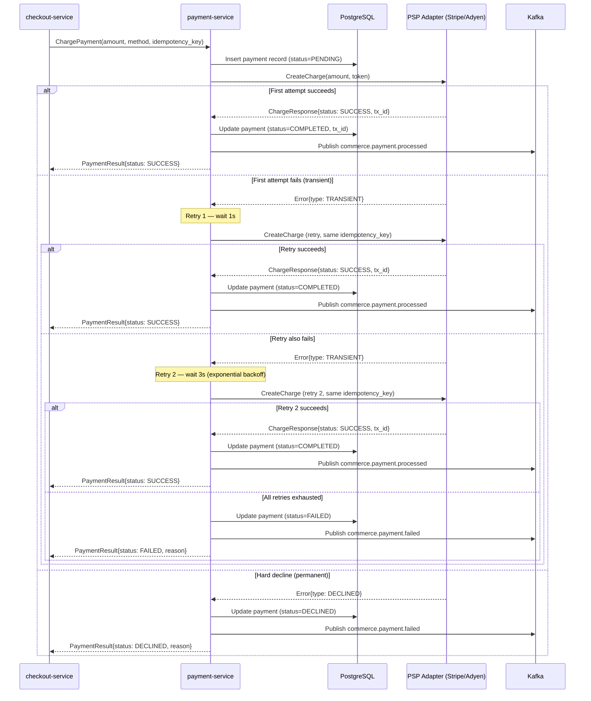

# payment-service

> Processes payments through PSP integrations with idempotent charging and automatic retry logic.

## Overview

The payment-service handles all monetary transactions in ShopOS. It integrates with one or more Payment Service Providers (PSPs) via an adapter pattern, ensuring that every charge attempt is idempotent using a caller-supplied idempotency key. Failed charges trigger a configurable retry policy before publishing a failure event. All payment records are persisted in PostgreSQL for reconciliation and audit.

## Architecture



## Tech Stack

| Component | Technology |
|---|---|
| Language | Java 21 |
| Framework | Spring Boot 3 + Spring gRPC |
| Database | PostgreSQL 16 |
| Migrations | Flyway |
| Messaging | Apache Kafka |
| Protocol | gRPC (port 50083) |
| Serialization | Protobuf (gRPC) + Avro (Kafka) |
| Retry | Spring Retry with exponential backoff |
| Health Check | grpc.health.v1 + HTTP /healthz |

## Responsibilities

- Accept payment charge requests with idempotency keys to prevent double-charging
- Route charges to the correct PSP adapter based on payment method type
- Implement retry logic with exponential backoff for transient PSP errors
- Distinguish transient failures (retry) from hard declines (do not retry)
- Persist all payment attempts and outcomes for reconciliation
- Handle refund requests originating from return-refund-service
- Publish `commerce.payment.processed` and `commerce.payment.failed` events
- Support capture/void flows for authorise-then-capture PSPs

## API / Interface

| Method | Request | Response | Description |
|---|---|---|---|
| `ChargePayment` | `ChargeRequest` | `PaymentResult` | Initiate a payment charge (idempotent) |
| `RefundPayment` | `RefundRequest` | `RefundResult` | Issue full or partial refund |
| `GetPayment` | `GetPaymentRequest` | `Payment` | Retrieve payment record by ID |
| `ListPaymentsByOrder` | `ListByOrderRequest` | `ListPaymentsResponse` | All payment attempts for an order |
| `VoidPayment` | `VoidRequest` | `VoidResult` | Void a previously authorised charge |
| `CapturePayment` | `CaptureRequest` | `CaptureResult` | Capture a previously authorised charge |

Proto file: `proto/commerce/payment.proto`

## Kafka Topics

| Topic | Event Type | Trigger |
|---|---|---|
| `commerce.payment.processed` | `PaymentProcessedEvent` | Payment charge succeeds |
| `commerce.payment.failed` | `PaymentFailedEvent` | All retry attempts exhausted or hard decline |

## Dependencies

**Upstream (callers)**
- `checkout-service` — primary caller for new charges
- `return-refund-service` — issues refunds
- `subscription-billing-service` — recurring charges

**Downstream (called by this service)**
- External PSP adapters (Stripe, Adyen — configured via env vars)
- PostgreSQL — payment record persistence

**Kafka consumers of payment events**
- `notification-orchestrator` — payment confirmation / failure notifications
- `fraud-detection-service` — post-payment fraud signal enrichment
- `reconciliation-service` — financial reconciliation

## Environment Variables

| Variable | Default | Description |
|---|---|---|
| `GRPC_PORT` | `50083` | gRPC listen port |
| `DB_HOST` | `postgres` | PostgreSQL hostname |
| `DB_PORT` | `5432` | PostgreSQL port |
| `DB_NAME` | `payments` | Database name |
| `DB_USER` | `payment_svc` | Database user |
| `DB_PASSWORD` | `` | Database password |
| `KAFKA_BOOTSTRAP_SERVERS` | `kafka:9092` | Kafka broker list |
| `PSP_PROVIDER` | `stripe` | Active PSP adapter (`stripe` or `adyen`) |
| `STRIPE_API_KEY` | `` | Stripe secret key |
| `ADYEN_API_KEY` | `` | Adyen API key |
| `ADYEN_MERCHANT_ACCOUNT` | `` | Adyen merchant account ID |
| `RETRY_MAX_ATTEMPTS` | `3` | Max charge retry attempts |
| `RETRY_INITIAL_INTERVAL_MS` | `1000` | Initial retry wait (ms) |
| `RETRY_MULTIPLIER` | `3` | Backoff multiplier |
| `LOG_LEVEL` | `INFO` | Logging level |
| `OTEL_EXPORTER_OTLP_ENDPOINT` | `` | OpenTelemetry collector endpoint |

## Running Locally

```bash
docker-compose up payment-service
```

## Health Check

`GET /healthz` → `{"status":"ok"}`

gRPC health: `grpc.health.v1.Health/Check` → `SERVING`
