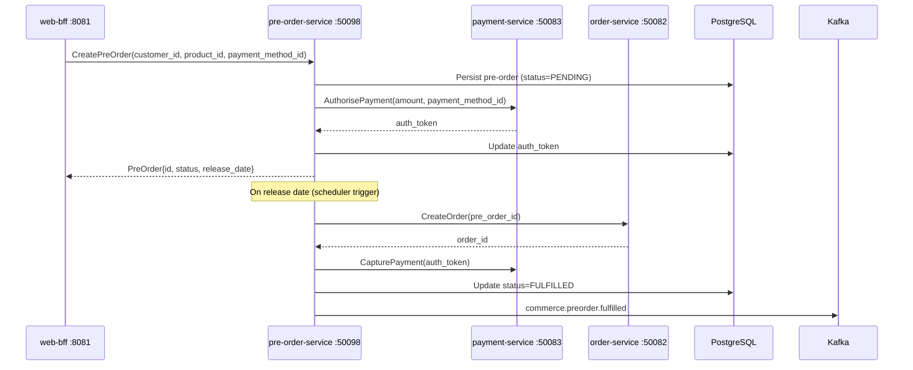

# pre-order-service

> Manages pre-orders for products not yet released, holding customer intent and payment auth until the release date.

## Overview

The pre-order-service captures customer intent to purchase unreleased or upcoming products by creating a pre-order record and authorising the customer's payment method without immediately capturing funds. On the product's release date the service transitions eligible pre-orders to a fulfilled state by triggering order creation via order-service and requesting payment capture via payment-service. This allows the business to gauge demand, guarantee units for early buyers, and execute automatic fulfilment without manual intervention.

## Architecture



## Tech Stack

| Component | Technology |
|---|---|
| Language | Go 1.24 |
| Database | PostgreSQL 16 |
| Migrations | golang-migrate |
| Messaging | Apache Kafka |
| Protocol | gRPC (port 50098) |
| Health Check | HTTP /healthz |

## Key Responsibilities

- Accept pre-order requests for unreleased products and validate product eligibility
- Authorise (but not capture) the customer's payment method at pre-order time
- Persist pre-order records with status lifecycle: PENDING → CONFIRMED → FULFILLED / CANCELLED
- Auto-fulfil pre-orders on the product release date via order-service and payment-service
- Support cancellation with payment auth void before release date
- Enforce per-customer pre-order limits per product
- Publish `commerce.preorder.placed` and `commerce.preorder.fulfilled` Kafka events

## Environment Variables

| Variable | Default | Description |
|---|---|---|
| `GRPC_PORT` | `50098` | gRPC listen port |
| `DATABASE_URL` | — | PostgreSQL connection string |

## Running Locally

```bash
docker-compose up pre-order-service
```

## Health Check

`GET /healthz` → `{"status":"ok"}`

gRPC health: `grpc.health.v1.Health/Check` → `SERVING`
