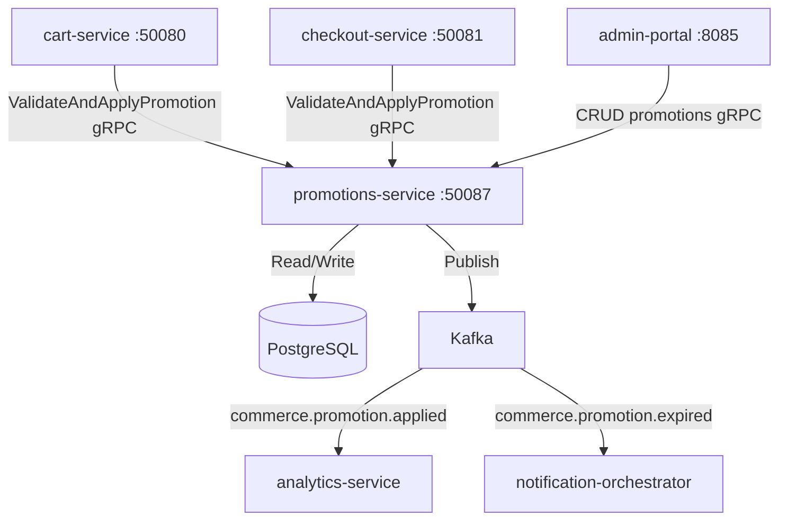

# promotions-service

> Manages coupon codes, discount rules, flash sales, and promotional pricing campaigns.

## Overview

The promotions-service is a Java/Spring Boot service that acts as the authoritative source for all discount logic in ShopOS. It evaluates stacked promotions and coupon codes against a cart or order, returning a structured discount breakdown. Promotion rules are persisted in PostgreSQL and support rich conditions: minimum order value, eligible SKUs/categories, customer tiers, geographic restrictions, and time windows including flash sales.

## Architecture



## Tech Stack

| Component | Technology |
|---|---|
| Language | Java 21 |
| Framework | Spring Boot 3 + Spring gRPC |
| Database | PostgreSQL 16 |
| Migrations | Flyway |
| Messaging | Apache Kafka |
| Protocol | gRPC (port 50087) |
| Serialization | Protobuf (gRPC) + Avro (Kafka) |
| Health Check | grpc.health.v1 + HTTP /healthz |

## Responsibilities

- Store and manage promotion definitions: percentage discounts, fixed amounts, buy-X-get-Y, free shipping
- Validate coupon codes for eligibility (expiry, usage limits, customer eligibility, minimum spend)
- Evaluate and stack multiple applicable promotions in priority order
- Enforce per-customer and global usage limits on codes
- Schedule flash sale activations and automatic deactivation at end time
- Return itemised discount breakdown showing which promotion applied to which line item
- Publish analytics events for promotion tracking and reporting

## API / Interface

| Method | Request | Response | Description |
|---|---|---|---|
| `ValidateCode` | `ValidateCodeRequest{code, cart, customer_id}` | `ValidationResponse{valid, discount_preview}` | Check if a coupon code is applicable |
| `ApplyPromotions` | `ApplyPromotionsRequest{cart, customer_id, code?}` | `PromotionsResult{discounts[], total_savings}` | Evaluate and apply all eligible promotions |
| `CreatePromotion` | `CreatePromotionRequest` | `Promotion` | Admin: create a new promotion |
| `UpdatePromotion` | `UpdatePromotionRequest` | `Promotion` | Admin: modify an existing promotion |
| `GetPromotion` | `GetPromotionRequest` | `Promotion` | Retrieve a promotion by ID |
| `ListPromotions` | `ListPromotionsRequest` | `ListPromotionsResponse` | Admin: list promotions with filters |
| `DeactivatePromotion` | `DeactivateRequest` | `Promotion` | Admin: deactivate a live promotion |

Proto file: `proto/commerce/promotions.proto`

## Kafka Topics

| Topic | Event Type | Trigger |
|---|---|---|
| `commerce.promotion.applied` | `PromotionAppliedEvent` | A promotion is applied to an order |
| `commerce.promotion.expired` | `PromotionExpiredEvent` | A promotion reaches its end date |

## Dependencies

Upstream (callers)
- `cart-service` — real-time promotion evaluation on cart mutations
- `checkout-service` — final promotion validation at checkout confirmation
- `admin-portal` — promotion management CRUD operations

Downstream (called by this service)
- PostgreSQL — promotion rule and usage persistence
- Kafka — analytics and notification events

## Environment Variables

| Variable | Default | Description |
|---|---|---|
| `GRPC_PORT` | `50087` | gRPC listen port |
| `DB_HOST` | `postgres` | PostgreSQL hostname |
| `DB_PORT` | `5432` | PostgreSQL port |
| `DB_NAME` | `promotions` | Database name |
| `DB_USER` | `promotions_svc` | Database user |
| `DB_PASSWORD` | `` | Database password |
| `KAFKA_BOOTSTRAP_SERVERS` | `kafka:9092` | Kafka broker list |
| `KAFKA_SCHEMA_REGISTRY_URL` | `http://schema-registry:8081` | Confluent Schema Registry URL |
| `MAX_STACKABLE_PROMOTIONS` | `3` | Maximum number of promotions that can stack on one order |
| `LOG_LEVEL` | `INFO` | Logging level |
| `OTEL_EXPORTER_OTLP_ENDPOINT` | `` | OpenTelemetry collector endpoint |

## Running Locally

```bash
docker-compose up promotions-service
```

## Health Check

`GET /healthz` → `{"status":"ok"}`

gRPC health: `grpc.health.v1.Health/Check` → `SERVING`
