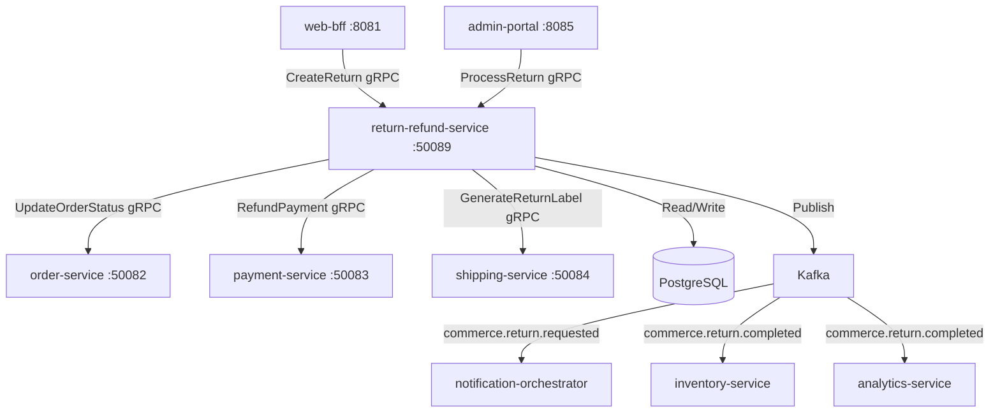

# return-refund-service

> Processes Return Merchandise Authorisations (RMA), coordinates refund initiation, and triggers restocking of returned goods.

## Overview

The return-refund-service manages the full post-purchase return lifecycle: accepting return requests, validating eligibility against return policies, issuing RMA numbers, coordinating return shipping labels via shipping-service, triggering refunds through payment-service, and notifying inventory of restocked items. It is built with C#/.NET 9 backed by PostgreSQL.

## Architecture



## Tech Stack

| Component | Technology |
|---|---|
| Language | C# / .NET 9 |
| Framework | ASP.NET Core + Grpc.AspNetCore |
| Database | PostgreSQL 16 |
| Migrations | EF Core Migrations |
| Messaging | Apache Kafka |
| Protocol | gRPC (port 50089) |
| Serialization | Protobuf (gRPC) + Avro (Kafka) |
| Health Check | grpc.health.v1 + HTTP /healthz |

## Responsibilities

- Accept and validate return requests against configurable return window policies
- Issue RMA numbers and track return status through its own state machine
- Generate prepaid return shipping labels in cooperation with shipping-service
- Trigger full or partial refunds via payment-service upon return receipt confirmation
- Update order status in order-service to reflect return state
- Notify inventory-service to restock returned items after quality inspection
- Publish return lifecycle events for customer notifications and analytics

## API / Interface

| Method | Request | Response | Description |
|---|---|---|---|
| `CreateReturn` | `CreateReturnRequest{order_id, items[], reason}` | `ReturnRequest{rma_id, return_label}` | Customer initiates a return |
| `GetReturn` | `GetReturnRequest{rma_id}` | `ReturnRequest` | Retrieve RMA status |
| `ListReturnsByOrder` | `ListByOrderRequest{order_id}` | `ListReturnsResponse` | All returns for an order |
| `ProcessReturn` | `ProcessReturnRequest{rma_id, condition, restock}` | `ReturnRequest` | Warehouse agent marks return received |
| `IssueRefund` | `IssueRefundRequest{rma_id, amount?}` | `RefundResult` | Admin: manually trigger refund |
| `CancelReturn` | `CancelReturnRequest{rma_id}` | `ReturnRequest` | Cancel a pending return request |

Proto file: `proto/commerce/return_refund.proto`

## Kafka Topics

| Topic | Event Type | Trigger |
|---|---|---|
| `commerce.return.requested` | `ReturnRequestedEvent` | Customer submits a return request |
| `commerce.return.completed` | `ReturnCompletedEvent` | Return processed and refund issued |

## Dependencies

Upstream (callers)
- `web-bff` / `mobile-bff` — customer return initiation
- `admin-portal` — warehouse and CS agent processing

Downstream (called by this service)
- `order-service` — update order status to `return_requested` / `returned`
- `payment-service` — issue refund to original payment method
- `shipping-service` — generate prepaid return labels
- `inventory-service` (via Kafka `commerce.return.completed`) — restock returned items

## Environment Variables

| Variable | Default | Description |
|---|---|---|
| `GRPC_PORT` | `50089` | gRPC listen port |
| `DB_HOST` | `postgres` | PostgreSQL hostname |
| `DB_PORT` | `5432` | PostgreSQL port |
| `DB_NAME` | `returns` | Database name |
| `DB_USER` | `returns_svc` | Database user |
| `DB_PASSWORD` | `` | Database password |
| `KAFKA_BOOTSTRAP_SERVERS` | `kafka:9092` | Kafka broker list |
| `ORDER_SERVICE_ADDR` | `order-service:50082` | Order service address |
| `PAYMENT_SERVICE_ADDR` | `payment-service:50083` | Payment service address |
| `SHIPPING_SERVICE_ADDR` | `shipping-service:50084` | Shipping service address |
| `RETURN_WINDOW_DAYS` | `30` | Default return eligibility window |
| `AUTO_REFUND_ON_RECEIPT` | `true` | Automatically issue refund when return is marked received |
| `LOG_LEVEL` | `Information` | Logging level |
| `OTEL_EXPORTER_OTLP_ENDPOINT` | `` | OpenTelemetry collector endpoint |

## Running Locally

```bash
docker-compose up return-refund-service
```

## Health Check

`GET /healthz` → `{"status":"ok"}`

gRPC health: `grpc.health.v1.Health/Check` → `SERVING`
