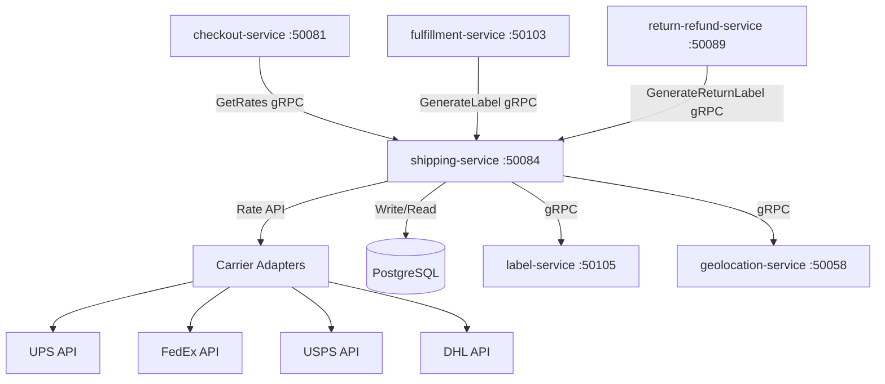

# shipping-service

> Provides shipping rate calculation, carrier selection, and shipping label generation for orders.

## Overview

The shipping-service integrates with multiple carrier APIs to fetch real-time shipping rates, select the optimal carrier based on cost and delivery SLA, and generate shipping labels. Written in Rust for high-throughput rate-shopping scenarios, it stores shipment records in PostgreSQL and exposes a gRPC API consumed by checkout-service and fulfillment-service.

## Architecture



## Tech Stack

| Component | Technology |
|---|---|
| Language | Rust (stable) |
| Framework | tonic (gRPC) + tokio async runtime |
| Database | PostgreSQL 16 |
| Migrations | sqlx migrate |
| Protocol | gRPC (port 50084) |
| Serialization | Protobuf |
| HTTP Client | reqwest (carrier API calls) |
| Health Check | grpc.health.v1 + HTTP /healthz |

## Responsibilities

- Fetch real-time shipping rates from multiple carriers in parallel
- Rank and filter carrier options by price, delivery time, and configured rules
- Generate outbound shipping labels via carrier APIs or label-service
- Generate return shipping labels for RMA workflows
- Store shipment records with tracking numbers
- Validate delivery address eligibility per carrier and service level
- Support dimensional weight calculation for accurate rate quoting

## API / Interface

| Method | Request | Response | Description |
|---|---|---|---|
| `GetRates` | `GetRatesRequest` | `GetRatesResponse` | Fetch available shipping options with rates |
| `GenerateLabel` | `GenerateLabelRequest` | `Label` | Create outbound shipping label |
| `GenerateReturnLabel` | `GenerateReturnLabelRequest` | `Label` | Create prepaid return label for RMA |
| `GetShipment` | `GetShipmentRequest` | `Shipment` | Retrieve shipment record by ID |
| `ListShipmentsByOrder` | `ListByOrderRequest` | `ListShipmentsResponse` | All shipments for an order |
| `VoidLabel` | `VoidLabelRequest` | `VoidResult` | Void an unused label with the carrier |

Proto file: `proto/commerce/shipping.proto`

## Kafka Topics

The shipping-service does not publish Kafka events directly. Shipment status updates are propagated by tracking-service after polling carrier tracking APIs.

## Dependencies

Upstream (callers)
- `checkout-service` — rate shopping during checkout
- `fulfillment-service` — label generation at dispatch
- `return-refund-service` — return label generation

Downstream (called by this service)
- External carrier APIs (UPS, FedEx, USPS, DHL)
- `label-service` — PDF label rendering for ZPL/PDF output
- `geolocation-service` — address geocoding for zone calculation
- PostgreSQL — shipment persistence

## Environment Variables

| Variable | Default | Description |
|---|---|---|
| `GRPC_PORT` | `50084` | gRPC listen port |
| `DATABASE_URL` | `postgres://shipping_svc@postgres/shipping` | PostgreSQL connection URL |
| `UPS_CLIENT_ID` | `` | UPS OAuth client ID |
| `UPS_CLIENT_SECRET` | `` | UPS OAuth client secret |
| `FEDEX_API_KEY` | `` | FedEx API key |
| `FEDEX_ACCOUNT_NUMBER` | `` | FedEx account number |
| `USPS_USER_ID` | `` | USPS Web Tools user ID |
| `DHL_API_KEY` | `` | DHL Express API key |
| `LABEL_SERVICE_ADDR` | `label-service:50105` | Label service address |
| `GEOLOCATION_SERVICE_ADDR` | `geolocation-service:50058` | Geolocation service address |
| `LOG_LEVEL` | `info` | Logging level (trace/debug/info/warn/error) |
| `OTEL_EXPORTER_OTLP_ENDPOINT` | `` | OpenTelemetry collector endpoint |

## Running Locally

```bash
docker-compose up shipping-service
```

## Health Check

`GET /healthz` → `{"status":"ok"}`

gRPC health: `grpc.health.v1.Health/Check` → `SERVING`
