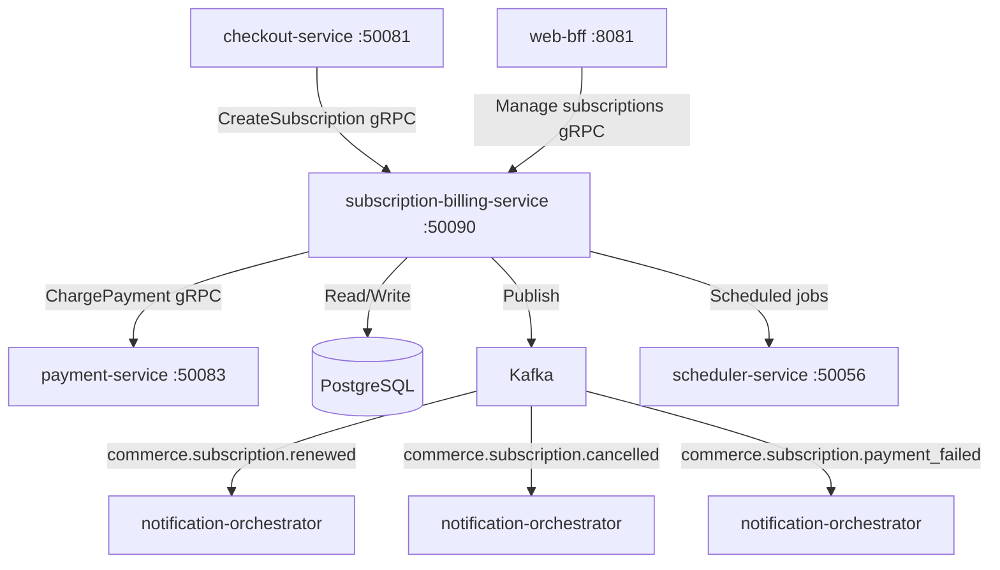

# subscription-billing-service

> Manages recurring subscription billing cycles, dunning workflows, and subscription lifecycle state.

## Overview

The subscription-billing-service handles all recurring revenue operations in ShopOS. It stores subscription plans and customer subscriptions in PostgreSQL, triggers recurring charges through payment-service on configurable billing intervals, and executes a dunning workflow when payments fail (retry schedule with escalating customer notifications). It integrates with subscription-product-service for plan definitions and with notification-orchestrator for billing communications.

## Architecture



## Tech Stack

| Component | Technology |
|---|---|
| Language | Go 1.23 |
| Framework | Standard library + google.golang.org/grpc |
| Database | PostgreSQL 16 |
| Migrations | golang-migrate |
| Messaging | Apache Kafka |
| Scheduling | scheduler-service integration |
| Protocol | gRPC (port 50090) |
| Serialization | Protobuf (gRPC) + Avro (Kafka) |
| Health Check | grpc.health.v1 + HTTP /healthz |

## Responsibilities

- Create and manage customer subscriptions with plan, billing interval, and payment method
- Trigger renewal charges at the correct billing date via scheduler-service
- Execute configurable dunning schedule on payment failure (retry at day 1, 3, 7)
- Suspend subscriptions after dunning exhaustion and cancel after configurable grace period
- Handle mid-cycle plan upgrades and downgrades with proration calculation
- Support immediate cancellation and end-of-period cancellation requests
- Publish subscription lifecycle events for communications and analytics

## API / Interface

| Method | Request | Response | Description |
|---|---|---|---|
| `CreateSubscription` | `CreateSubscriptionRequest` | `Subscription` | Start a new subscription for a customer |
| `GetSubscription` | `GetSubscriptionRequest` | `Subscription` | Retrieve subscription by ID |
| `ListSubscriptionsByCustomer` | `ListRequest{customer_id}` | `ListSubscriptionsResponse` | All subscriptions for a customer |
| `CancelSubscription` | `CancelRequest{sub_id, immediate}` | `Subscription` | Cancel at period end or immediately |
| `PauseSubscription` | `PauseRequest{sub_id, resume_date?}` | `Subscription` | Pause billing temporarily |
| `ResumeSubscription` | `ResumeRequest{sub_id}` | `Subscription` | Resume a paused subscription |
| `ChangePlan` | `ChangePlanRequest{sub_id, new_plan_id}` | `Subscription` | Upgrade or downgrade plan with proration |
| `UpdatePaymentMethod` | `UpdatePaymentRequest` | `Subscription` | Change the payment method on file |
| `ListPlans` | `ListPlansRequest` | `ListPlansResponse` | Retrieve available subscription plans |

Proto file: `proto/commerce/subscription_billing.proto`

## Kafka Topics

| Topic | Event Type | Trigger |
|---|---|---|
| `commerce.subscription.created` | `SubscriptionCreatedEvent` | New subscription activated |
| `commerce.subscription.renewed` | `SubscriptionRenewedEvent` | Successful renewal charge |
| `commerce.subscription.payment_failed` | `SubscriptionPaymentFailedEvent` | Renewal charge fails |
| `commerce.subscription.cancelled` | `SubscriptionCancelledEvent` | Subscription cancelled |
| `commerce.subscription.suspended` | `SubscriptionSuspendedEvent` | Dunning exhausted, subscription suspended |

## Dependencies

**Upstream (callers)**
- `checkout-service` — creates subscriptions for subscription-product purchases
- `web-bff` / `mobile-bff` — customer self-service subscription management

**Downstream (called by this service)**
- `payment-service` — recurring charge execution
- `scheduler-service` — schedule next billing date job
- `notification-orchestrator` (via Kafka) — billing cycle communications

## Environment Variables

| Variable | Default | Description |
|---|---|---|
| `GRPC_PORT` | `50090` | gRPC listen port |
| `DB_HOST` | `postgres` | PostgreSQL hostname |
| `DB_PORT` | `5432` | PostgreSQL port |
| `DB_NAME` | `subscriptions` | Database name |
| `DB_USER` | `billing_svc` | Database user |
| `DB_PASSWORD` | `` | Database password |
| `KAFKA_BOOTSTRAP_SERVERS` | `kafka:9092` | Kafka broker list |
| `PAYMENT_SERVICE_ADDR` | `payment-service:50083` | Payment service address |
| `SCHEDULER_SERVICE_ADDR` | `scheduler-service:50056` | Scheduler service address |
| `DUNNING_RETRY_DAYS` | `1,3,7` | Comma-separated dunning retry days |
| `DUNNING_GRACE_PERIOD_DAYS` | `14` | Days before cancellation after dunning exhaustion |
| `LOG_LEVEL` | `info` | Logging level |
| `OTEL_EXPORTER_OTLP_ENDPOINT` | `` | OpenTelemetry collector endpoint |

## Running Locally

```bash
docker-compose up subscription-billing-service
```

## Health Check

`GET /healthz` → `{"status":"ok"}`

gRPC health: `grpc.health.v1.Health/Check` → `SERVING`
