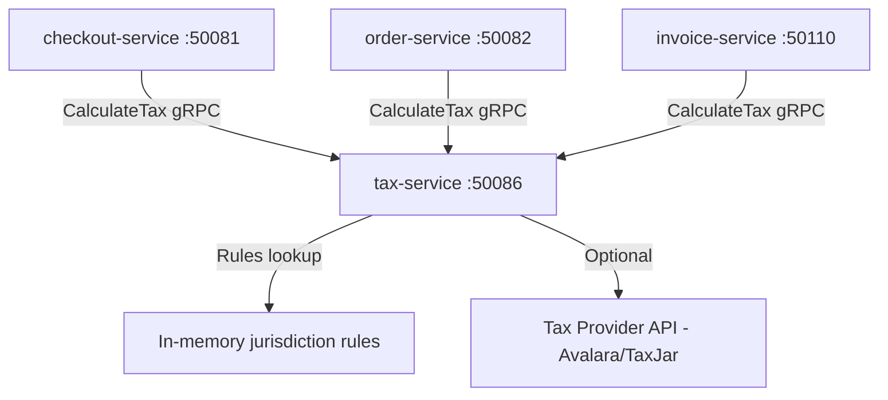

# tax-service

> Calculates applicable taxes for orders by jurisdiction, supporting VAT, GST, and US sales tax rules.

## Overview

The tax-service is a stateless Go service that computes tax obligations for a given set of line items and a shipping/billing address. It applies jurisdiction-specific rules for VAT (EU), GST (AU/CA/IN), and US sales tax across all states, including product-category tax exemptions and tax-exempt customer certificates. The service is called synchronously during checkout and does not persist data of its own.

## Architecture



## Tech Stack

| Component | Technology |
|---|---|
| Language | Go 1.23 |
| Framework | Standard library + google.golang.org/grpc |
| Rules Storage | In-memory (loaded from config at startup) |
| External Provider | Avalara / TaxJar (optional adapter) |
| Protocol | gRPC (port 50086) |
| Serialization | Protobuf |
| Health Check | grpc.health.v1 + HTTP /healthz |

## Responsibilities

- Calculate total tax and per-line-item tax breakdown for a given order
- Apply correct tax rates based on shipping destination jurisdiction (country, state/province, postal code)
- Support EU VAT calculation including reverse-charge for B2B cross-border transactions
- Support GST/HST/PST calculation for Australian and Canadian jurisdictions
- Handle product category tax exemptions (e.g., groceries, medical goods)
- Honour customer-level tax exemption certificates
- Support configurable adapter to delegate to external tax provider (Avalara, TaxJar) when high compliance accuracy is required

## API / Interface

| Method | Request | Response | Description |
|---|---|---|---|
| `CalculateTax` | `TaxRequest{items, shipping_address, billing_address, customer_id}` | `TaxResponse{tax_lines[], total_tax, currency}` | Compute full tax breakdown for an order |
| `ValidateExemption` | `ExemptionRequest{customer_id, certificate_id}` | `ExemptionResponse{valid, expires_at}` | Validate a customer's tax exemption certificate |
| `GetJurisdictionRates` | `JurisdictionRequest{country, state, postal_code}` | `JurisdictionResponse{rates[]}` | Retrieve rates for a jurisdiction (admin/debug) |

Proto file: `proto/commerce/tax.proto`

## Kafka Topics

The tax-service does not produce or consume Kafka topics. Tax figures are embedded within order and invoice records.

## Dependencies

Upstream (callers)
- `checkout-service` — tax estimate during checkout flow
- `order-service` — confirmed tax on order creation
- `invoice-service` — tax lines on invoices

Downstream (called by this service)
- External tax provider API (Avalara / TaxJar) — optional, for high-compliance mode
- No database dependencies; jurisdiction rules loaded from config files at startup

## Environment Variables

| Variable | Default | Description |
|---|---|---|
| `GRPC_PORT` | `50086` | gRPC listen port |
| `TAX_PROVIDER` | `internal` | Tax calculation backend (`internal`, `avalara`, `taxjar`) |
| `AVALARA_ACCOUNT_ID` | `` | Avalara account ID |
| `AVALARA_LICENSE_KEY` | `` | Avalara license key |
| `AVALARA_COMPANY_CODE` | `` | Avalara company code |
| `TAXJAR_API_KEY` | `` | TaxJar API key |
| `RULES_CONFIG_PATH` | `/etc/tax/rules` | Path to jurisdiction rules configuration files |
| `DEFAULT_TAX_COUNTRY` | `US` | Default country for tax calculation |
| `LOG_LEVEL` | `info` | Logging level |
| `OTEL_EXPORTER_OTLP_ENDPOINT` | `` | OpenTelemetry collector endpoint |

## Running Locally

```bash
docker-compose up tax-service
```

## Health Check

`GET /healthz` → `{"status":"ok"}`

gRPC health: `grpc.health.v1.Health/Check` → `SERVING`
