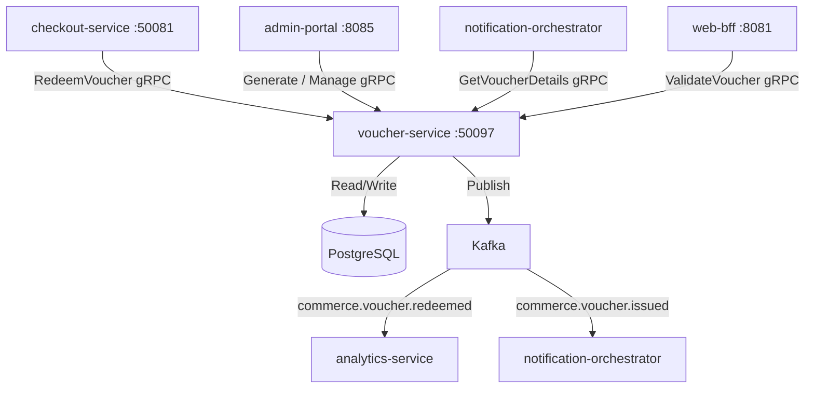

# voucher-service

> Generates, validates, and tracks redemption of single-use and multi-use vouchers for promotions and campaigns.

## Overview

The voucher-service manages promotional vouchers distinct from coupon codes handled by promotions-service. Vouchers are typically used for targeted campaigns — customer win-back, referral rewards, partner co-marketing — and can be generated in bulk or individually. Each voucher has a redemption policy (single-use or limited multi-use), monetary or percentage value, and optional audience restrictions. Voucher state and redemption history are persisted in PostgreSQL.

## Architecture



## Tech Stack

| Component | Technology |
|---|---|
| Language | Go 1.23 |
| Framework | Standard library + google.golang.org/grpc |
| Database | PostgreSQL 16 |
| Migrations | golang-migrate |
| Messaging | Apache Kafka |
| Code Generation | crypto/rand (CSPRNG) |
| Protocol | gRPC (port 50097) |
| Serialization | Protobuf (gRPC) + Avro (Kafka) |
| Health Check | grpc.health.v1 + HTTP /healthz |

## Responsibilities

- Generate individual or bulk batches of voucher codes using cryptographically secure randomness
- Store voucher definitions with discount type (percentage / fixed), value, currency, and constraints
- Validate voucher codes at checkout: check existence, expiry, usage limits, audience eligibility
- Record each redemption with order ID, customer ID, and timestamp
- Enforce per-customer redemption limits to prevent abuse
- Support campaign-level grouping of vouchers for reporting
- Publish redemption and issuance events for analytics and notification workflows
- Allow admin void of individual vouchers or entire campaigns

## API / Interface

| Method | Request | Response | Description |
|---|---|---|---|
| `ValidateVoucher` | `ValidateRequest{code, customer_id, cart_total}` | `ValidationResult{valid, discount_amount, reason?}` | Check if a voucher is applicable |
| `RedeemVoucher` | `RedeemRequest{code, customer_id, order_id, idempotency_key}` | `RedemptionResult{redeemed, discount_applied}` | Consume a voucher for an order |
| `GenerateVoucher` | `GenerateRequest{campaign_id, count, config}` | `GenerateResponse{codes[]}` | Admin: create one or more voucher codes |
| `GetVoucher` | `GetVoucherRequest{code}` | `Voucher` | Retrieve voucher details by code |
| `VoidVoucher` | `VoidRequest{code, reason}` | `Voucher` | Admin: invalidate a specific voucher code |
| `ListCampaignVouchers` | `ListRequest{campaign_id, page, page_size}` | `ListVouchersResponse` | Admin: list vouchers in a campaign |
| `GetCampaignStats` | `StatsRequest{campaign_id}` | `CampaignStats{issued, redeemed, remaining}` | Admin: redemption statistics for a campaign |

Proto file: `proto/commerce/voucher.proto`

## Kafka Topics

| Topic | Event Type | Trigger |
|---|---|---|
| `commerce.voucher.issued` | `VoucherIssuedEvent` | Voucher code sent to a customer |
| `commerce.voucher.redeemed` | `VoucherRedeemedEvent` | Voucher successfully applied to an order |

## Dependencies

Upstream (callers)
- `checkout-service` — validate and redeem voucher at checkout
- `web-bff` — pre-checkout voucher validation
- `admin-portal` — campaign and voucher management
- `notification-orchestrator` — retrieves voucher details for email personalisation

Downstream (called by this service)
- PostgreSQL — voucher and redemption persistence
- Kafka — analytics and notification events

## Environment Variables

| Variable | Default | Description |
|---|---|---|
| `GRPC_PORT` | `50097` | gRPC listen port |
| `DB_HOST` | `postgres` | PostgreSQL hostname |
| `DB_PORT` | `5432` | PostgreSQL port |
| `DB_NAME` | `vouchers` | Database name |
| `DB_USER` | `voucher_svc` | Database user |
| `DB_PASSWORD` | `` | Database password |
| `KAFKA_BOOTSTRAP_SERVERS` | `kafka:9092` | Kafka broker list |
| `CODE_LENGTH` | `12` | Length of generated voucher codes (characters) |
| `MAX_BULK_GENERATE` | `10000` | Maximum voucher codes per bulk generation request |
| `DEFAULT_EXPIRY_DAYS` | `90` | Default voucher expiry period from issuance |
| `MAX_REDEMPTIONS_DEFAULT` | `1` | Default maximum redemptions per voucher |
| `LOG_LEVEL` | `info` | Logging level |
| `OTEL_EXPORTER_OTLP_ENDPOINT` | `` | OpenTelemetry collector endpoint |

## Running Locally

```bash
docker-compose up voucher-service
```

## Health Check

`GET /healthz` → `{"status":"ok"}`

gRPC health: `grpc.health.v1.Health/Check` → `SERVING`
