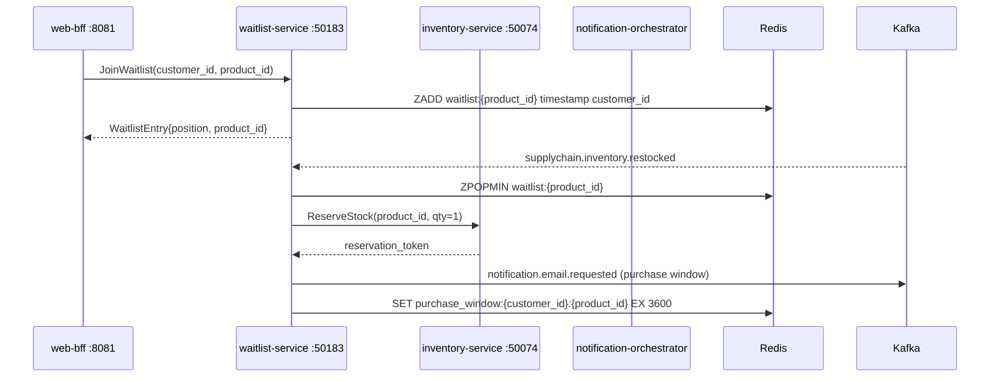

# waitlist-service

> Customer queue for sold-out products — notifies the next customer in line when stock becomes available.

## Overview

The waitlist-service maintains an ordered queue of customers who wish to purchase a sold-out product. When inventory-service emits a `supplychain.inventory.restocked` event, the service dequeues the first eligible customer and emits a notification event giving them a time-limited purchase window. Redis sorted sets are used for queue storage, ensuring O(log N) enqueue/dequeue operations and natural TTL-based expiry of stale entries.

## Architecture



## Tech Stack

| Component | Technology |
|---|---|
| Language | Go 1.24 |
| Database | Redis 7 (sorted sets + TTL keys) |
| Messaging | Apache Kafka |
| Protocol | gRPC (port 50183) |
| Health Check | HTTP /healthz |

## Key Responsibilities

- Enqueue customers into a per-product waitlist using Redis sorted sets (timestamp score)
- Report a customer's current queue position on demand
- Allow customers to leave a waitlist at any time
- Consume `supplychain.inventory.restocked` events and dequeue next-in-line customers
- Reserve stock via inventory-service before notifying the customer to prevent overselling
- Set a time-limited purchase window (default 1 hour) within which the customer must check out
- Release the reserved stock if the purchase window expires without a completed order
- Emit `notification.email.requested` Kafka events to alert customers of their turn

## Environment Variables

| Variable | Default | Description |
|---|---|---|
| `GRPC_PORT` | `50183` | gRPC listen port |
| `REDIS_URL` | — | Redis connection URL |

## Running Locally

```bash
docker-compose up waitlist-service
```

## Health Check

`GET /healthz` → `{"status":"ok"}`

gRPC health: `grpc.health.v1.Health/Check` → `SERVING`
