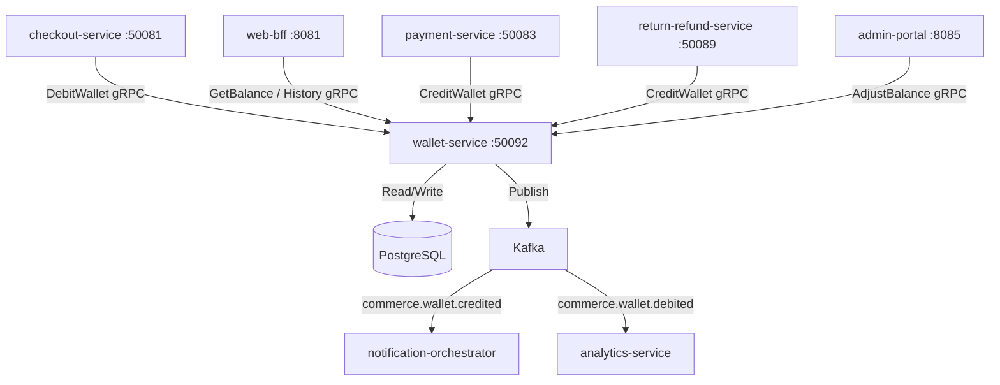

# wallet-service

> Manages digital wallet balances, top-ups, and spend transactions for ShopOS customers.

## Overview

The wallet-service provides an internal digital wallet for each customer, enabling store credit accumulation and spending at checkout. Balances are stored in PostgreSQL with a double-entry ledger pattern to ensure consistency. Customers can top up their wallet via payment-service and spend wallet balance as a payment method during checkout. All balance mutations are atomic and idempotent.

## Architecture



## Tech Stack

| Component | Technology |
|---|---|
| Language | Go 1.23 |
| Framework | Standard library + google.golang.org/grpc |
| Database | PostgreSQL 16 (double-entry ledger) |
| Migrations | golang-migrate |
| Messaging | Apache Kafka |
| Protocol | gRPC (port 50092) |
| Serialization | Protobuf (gRPC) + Avro (Kafka) |
| Health Check | grpc.health.v1 + HTTP /healthz |

## Responsibilities

- Maintain a per-customer wallet with an immutable double-entry ledger
- Process wallet top-ups funded by external payment methods via payment-service
- Debit wallet balances as a payment method during checkout
- Credit refunds to wallet when return-refund-service issues store credit
- Enforce idempotency on all balance mutations using caller-supplied idempotency keys
- Provide paginated transaction history for customer account views
- Support admin adjustments (promotional credits, dispute resolutions)
- Publish wallet mutation events for notifications and analytics

## API / Interface

| Method | Request | Response | Description |
|---|---|---|---|
| `GetBalance` | `GetBalanceRequest{customer_id}` | `WalletBalance{balance, currency}` | Get current wallet balance |
| `CreditWallet` | `CreditRequest{customer_id, amount, idempotency_key, reason}` | `Transaction` | Add funds to wallet |
| `DebitWallet` | `DebitRequest{customer_id, amount, idempotency_key, order_id}` | `Transaction` | Deduct funds from wallet |
| `TopUp` | `TopUpRequest{customer_id, amount, payment_method_id}` | `TopUpResult` | Fund wallet via external payment |
| `GetTransactionHistory` | `HistoryRequest{customer_id, page, page_size}` | `HistoryResponse{transactions[]}` | Paginated ledger history |
| `AdjustBalance` | `AdjustRequest{customer_id, delta, reason}` | `WalletBalance` | Admin: credit or debit adjustment |

Proto file: `proto/commerce/wallet.proto`

## Kafka Topics

| Topic | Event Type | Trigger |
|---|---|---|
| `commerce.wallet.credited` | `WalletCreditedEvent` | Funds added to wallet |
| `commerce.wallet.debited` | `WalletDebitedEvent` | Funds spent from wallet |

## Dependencies

Upstream (callers)
- `checkout-service` — wallet as payment method at checkout
- `payment-service` — top-up funding and refund-to-wallet
- `return-refund-service` — store credit refunds
- `web-bff` / `mobile-bff` — balance and history display
- `admin-portal` — manual adjustments

Downstream (called by this service)
- PostgreSQL — ledger persistence

## Environment Variables

| Variable | Default | Description |
|---|---|---|
| `GRPC_PORT` | `50092` | gRPC listen port |
| `DB_HOST` | `postgres` | PostgreSQL hostname |
| `DB_PORT` | `5432` | PostgreSQL port |
| `DB_NAME` | `wallets` | Database name |
| `DB_USER` | `wallet_svc` | Database user |
| `DB_PASSWORD` | `` | Database password |
| `KAFKA_BOOTSTRAP_SERVERS` | `kafka:9092` | Kafka broker list |
| `MAX_WALLET_BALANCE` | `10000.00` | Maximum allowable wallet balance (currency units) |
| `SUPPORTED_CURRENCIES` | `USD,EUR,GBP` | Comma-separated supported currency codes |
| `LOG_LEVEL` | `info` | Logging level |
| `OTEL_EXPORTER_OTLP_ENDPOINT` | `` | OpenTelemetry collector endpoint |

## Running Locally

```bash
docker-compose up wallet-service
```

## Health Check

`GET /healthz` → `{"status":"ok"}`

gRPC health: `grpc.health.v1.Health/Check` → `SERVING`
