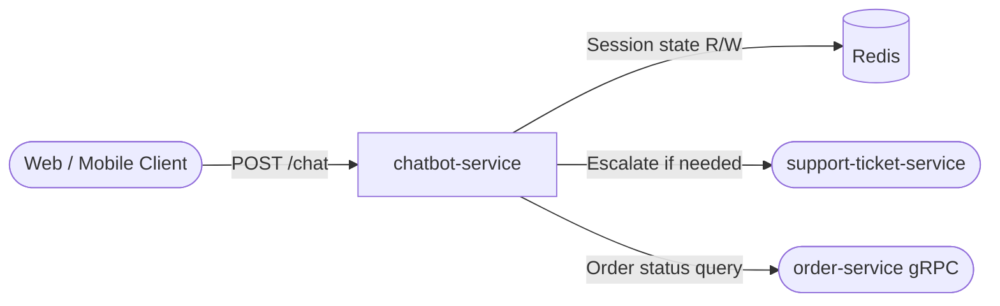

# chatbot-service

> Tier-1 customer support chatbot for the ShopOS communications domain.

## Overview

The chatbot-service provides rule-based + intent-classification chat for Tier-1 customer support deflection. It handles the most frequent query types — order status, returns, shipping, account access, and FAQs — reducing live-agent load. Conversation state is persisted in Redis keyed by session ID.

## Architecture



## Tech Stack

| Component | Technology |
|---|---|
| Language | Python 3.13 |
| Framework | FastAPI + uvicorn |
| Session Store | Redis |
| Intent Classification | Rule-based keyword matching |
| Containerization | Docker (slim runtime) |

## Responsibilities

- Accept inbound chat messages via `POST /chat`
- Classify user intent (order status, return/refund, cancel, payment, shipping, account, greeting)
- Return a structured reply with intent label and escalation flag
- Persist conversation session state in Redis (TTL: 30 min)
- Escalate complex queries to support-ticket-service

## API Endpoints

| Endpoint | Method | Description |
|---|---|---|
| `/healthz` | GET | Liveness probe |
| `/chat` | POST | Process a chat message and return intent + reply |
| `/docs` | GET | Swagger UI |

### POST /chat — Request

```json
{
  "session_id": "user-uuid-or-session-token",
  "message": "Where is my order?"
}
```

### POST /chat — Response

```json
{
  "session_id": "user-uuid-or-session-token",
  "reply": "I can help with order status! ...",
  "intent": "order_status",
  "escalate": false
}
```

## Environment Variables

| Variable | Default | Description |
|---|---|---|
| `HTTP_PORT` | `8193` | HTTP port |
| `GRPC_PORT` | `50189` | gRPC port |
| `REDIS_URL` | `redis://localhost:6379/0` | Redis connection URL |
| `SESSION_TTL_SECONDS` | `1800` | Conversation session TTL (seconds) |
| `LOG_LEVEL` | `info` | Logging verbosity |

## Running Locally

```bash
docker-compose up chatbot-service
```

## Health Check

`GET /healthz` → `{"status":"ok"}`
