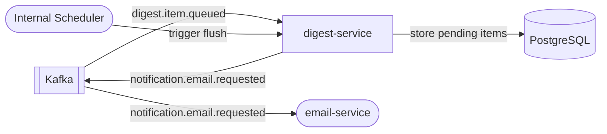

# digest-service

> Batches low-priority notifications into configurable daily or weekly digest emails.

## Overview

The digest-service intercepts low-priority notification events (e.g., wishlist price drops, new Q&A answers, product back-in-stock alerts) and accumulates them per user over a configurable time window. At the scheduled delivery time it compiles all pending items into a single digest email, reducing notification fatigue. Digest schedules are stored in Postgres and triggered by a built-in scheduler.

## Architecture



## Tech Stack

| Component | Technology |
|---|---|
| Language | Go |
| Kafka Consumer/Producer | confluent-kafka-go |
| Database | PostgreSQL |
| Migrations | golang-migrate |
| Scheduler | robfig/cron |
| Containerization | Docker |

## Responsibilities

- Consume `digest.item.queued` Kafka events emitted by other services for low-priority notifications
- Store pending digest items per user in Postgres with their source event payload
- Maintain per-user digest preference: `DAILY`, `WEEKLY`, or `DISABLED`
- Run a cron-driven flush job that collects all pending items for due users
- Compile items into a structured digest payload and publish an email request to Kafka
- Mark items as `SENT` after successful dispatch to prevent duplicate delivery
- Provide a gRPC API for users to update their digest preferences
- Respect user timezone for determining the correct delivery time

## API / Interface

gRPC service: (digest preferences management)

| Method | Request | Response | Description |
|---|---|---|---|
| `GetPreferences` | `GetPreferencesRequest` | `DigestPreferences` | Fetch user's digest schedule preference |
| `UpdatePreferences` | `UpdatePreferencesRequest` | `DigestPreferences` | Set digest frequency and delivery time |
| `GetPendingItems` | `GetPendingItemsRequest` | `PendingItemsResponse` | List queued items for a user (admin/debug) |
| `FlushUserDigest` | `FlushUserDigestRequest` | `FlushResult` | Manually trigger digest for a user (admin) |

## Kafka Topics

| Topic | Direction | Description |
|---|---|---|
| `digest.item.queued` | Consumes | Low-priority notification item to batch |
| `notification.email.requested` | Publishes | Compiled digest email send request |

## Dependencies

Upstream (consumes from)
- `wishlist-service` — price-drop digest items
- `qa-service` — new-answer digest items
- `inventory-service` — back-in-stock digest items
- Any domain service publishing `digest.item.queued`

Downstream (calls)
- `notification-orchestrator` / Kafka — publishes compiled digest email requests
- `template-service` — fetches digest email template via gRPC (called indirectly through email-service)

## Environment Variables

| Variable | Default | Description |
|---|---|---|
| `KAFKA_BROKERS` | `localhost:9092` | Comma-separated Kafka broker list |
| `KAFKA_GROUP_ID` | `digest-service` | Kafka consumer group |
| `DATABASE_URL` | `postgres://localhost:5432/digest` | PostgreSQL connection string |
| `DIGEST_DAILY_CRON` | `0 8 * * *` | Cron expression for daily digest flush (UTC) |
| `DIGEST_WEEKLY_CRON` | `0 8 * * 1` | Cron expression for weekly digest flush (UTC) |
| `DEFAULT_DIGEST_FREQUENCY` | `DAILY` | Default schedule for new users |
| `MAX_ITEMS_PER_DIGEST` | `20` | Maximum items included in one digest email |
| `PENDING_ITEM_TTL_DAYS` | `14` | Days before unsent items are discarded |
| `LOG_LEVEL` | `info` | Logging verbosity |

## Running Locally

```bash
docker-compose up digest-service
```

## Health Check

`GET /healthz` → `{"status":"ok"}`
