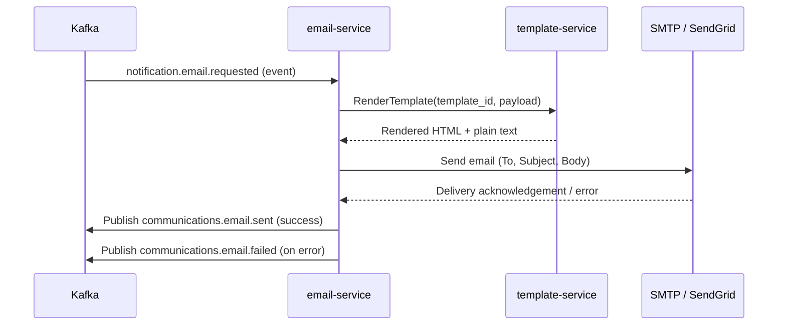

# email-service

> Consumes `notification.email.requested` events, renders Handlebars templates, and delivers via SMTP or SendGrid.

## Overview

The email-service is the final-mile delivery layer for outbound email in ShopOS. It consumes enriched email notification events from Kafka, fetches the appropriate template from `template-service`, renders it with the provided payload data, and dispatches the message through a configurable SMTP relay or the SendGrid API. Delivery status and bounce events are tracked for operational visibility.

## Architecture



## Tech Stack

| Component | Technology |
|---|---|
| Language | Python 3.12 |
| Framework | asyncio + aiokafka |
| Template Fetching | gRPC (grpcio) |
| SMTP | aiosmtplib |
| SendGrid SDK | sendgrid-python |
| Containerization | Docker |

## Responsibilities

- Consume `notification.email.requested` events from Kafka
- Resolve and fetch the correct template from `template-service` via gRPC
- Render the template with the event payload using Jinja2 (server-side fallback)
- Send the rendered email via SMTP (development/internal) or SendGrid (production)
- Retry failed sends with exponential back-off (configurable max retries)
- Publish delivery result events back to Kafka
- Track bounce and unsubscribe webhooks from SendGrid and mark users accordingly
- Support HTML + plain text multipart messages

## API / Interface

This service has no gRPC or HTTP API — it operates as a Kafka consumer.

SendGrid Webhook (inbound HTTP)

| Endpoint | Method | Description |
|---|---|---|
| `/webhooks/sendgrid` | `POST` | Receives delivery status, bounce, and unsubscribe events |

## Kafka Topics

| Topic | Direction | Description |
|---|---|---|
| `notification.email.requested` | Consumes | Inbound email send request from orchestrator |
| `communications.email.sent` | Publishes | Confirmation of successful delivery |
| `communications.email.failed` | Publishes | Delivery failure with error details |
| `communications.email.bounced` | Publishes | Bounce event received from provider |

## Dependencies

Upstream (consumes from)
- `notification-orchestrator` — publishes validated email requests

Downstream (calls)
- `template-service` — fetches and renders email templates via gRPC
- SendGrid API / SMTP relay — external email delivery infrastructure

## Environment Variables

| Variable | Default | Description |
|---|---|---|
| `KAFKA_BROKERS` | `localhost:9092` | Comma-separated Kafka broker list |
| `KAFKA_GROUP_ID` | `email-service` | Kafka consumer group |
| `TEMPLATE_SERVICE_ADDR` | `template-service:50131` | gRPC address for template rendering |
| `EMAIL_PROVIDER` | `smtp` | `smtp` or `sendgrid` |
| `SMTP_HOST` | `localhost` | SMTP server hostname |
| `SMTP_PORT` | `587` | SMTP server port |
| `SMTP_USERNAME` | _(secret)_ | SMTP authentication username |
| `SMTP_PASSWORD` | _(secret)_ | SMTP authentication password |
| `SENDGRID_API_KEY` | _(secret)_ | SendGrid API key (used when provider=sendgrid) |
| `FROM_EMAIL` | `noreply@shop.example.com` | Default sender address |
| `FROM_NAME` | `ShopOS` | Default sender display name |
| `MAX_RETRIES` | `3` | Maximum delivery retry attempts |
| `RETRY_BACKOFF_SECONDS` | `5` | Initial retry back-off delay |
| `LOG_LEVEL` | `INFO` | Logging verbosity |

## Running Locally

```bash
docker-compose up email-service
```

## Health Check

`GET /healthz` → `{"status":"ok"}`
