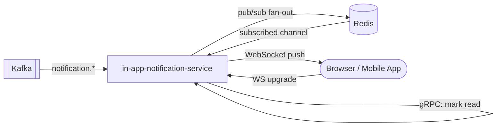

# in-app-notification-service

> Real-time in-app notifications delivered via WebSocket with Redis pub/sub for horizontal scaling.

## Overview

The in-app-notification-service delivers real-time notifications directly to users within the ShopOS web and mobile frontends. Notifications are pushed over persistent WebSocket connections, with Redis pub/sub handling cross-instance message fan-out to support horizontal scaling. Unread notifications are persisted in Redis so users receive missed notifications on reconnect.

## Architecture



## Tech Stack

| Component | Technology |
|---|---|
| Language | Go |
| WebSocket | gorilla/websocket |
| gRPC | google.golang.org/grpc |
| Pub/Sub + Store | Redis |
| Redis Client | go-redis/v9 |
| Kafka Consumer | confluent-kafka-go |
| Containerization | Docker |

## Responsibilities

- Accept and manage WebSocket connections from authenticated browser/app clients
- Subscribe to per-user Redis pub/sub channels to receive notifications from any service instance
- Push real-time notification payloads to connected clients over WebSocket
- Persist unread notifications in Redis with a configurable retention window
- Serve the unread notification list on reconnect so no messages are missed
- Mark notifications as read/dismissed via gRPC (called by frontend via API gateway)
- Consume relevant Kafka events and convert them to in-app notification payloads
- Enforce a maximum unread notification cap per user

## API / Interface

WebSocket endpoint: `ws://<host>/notifications` (port 50132)

gRPC service: `InAppNotificationService` (port 50132)

| Method | Request | Response | Description |
|---|---|---|---|
| `GetUnread` | `GetUnreadRequest` | `GetUnreadResponse` | Fetch unread notifications for a user |
| `MarkRead` | `MarkReadRequest` | `Empty` | Mark one or more notifications as read |
| `MarkAllRead` | `MarkAllReadRequest` | `Empty` | Mark all notifications as read |
| `DismissNotification` | `DismissRequest` | `Empty` | Remove a notification from the list |
| `GetNotificationCount` | `GetCountRequest` | `CountResponse` | Get unread count (used for badge) |

## Kafka Topics

| Topic | Direction | Description |
|---|---|---|
| `notification.email.requested` | Consumes | Converts to in-app counterpart when applicable |
| `notification.push.requested` | Consumes | Mirrors push events as in-app notifications |
| `commerce.order.placed` | Consumes | Order confirmation in-app notification |
| `commerce.order.fulfilled` | Consumes | Shipment/delivery in-app notification |

## Dependencies

Upstream (callers / sends to)
- `api-gateway` — proxies WebSocket upgrades and gRPC `MarkRead` calls from the frontend

Downstream (calls)
- `auth-service` — validates JWT during WebSocket handshake
- `notification-orchestrator` — source of notification events via Kafka

## Environment Variables

| Variable | Default | Description |
|---|---|---|
| `PORT` | `50132` | WebSocket + gRPC server port |
| `REDIS_ADDR` | `localhost:6379` | Redis server address |
| `REDIS_PASSWORD` | `` | Redis password (empty = no auth) |
| `REDIS_DB` | `4` | Redis database index |
| `KAFKA_BROKERS` | `localhost:9092` | Comma-separated Kafka broker list |
| `KAFKA_GROUP_ID` | `in-app-notification-service` | Kafka consumer group |
| `UNREAD_TTL_SECONDS` | `604800` | Unread notification retention (7 days) |
| `MAX_UNREAD_PER_USER` | `100` | Maximum unread notifications stored per user |
| `AUTH_SERVICE_ADDR` | `auth-service:50060` | gRPC address for token validation |
| `LOG_LEVEL` | `info` | Logging verbosity |

## Running Locally

```bash
docker-compose up in-app-notification-service
```

## Health Check

`GET /healthz` → `{"status":"ok"}`
