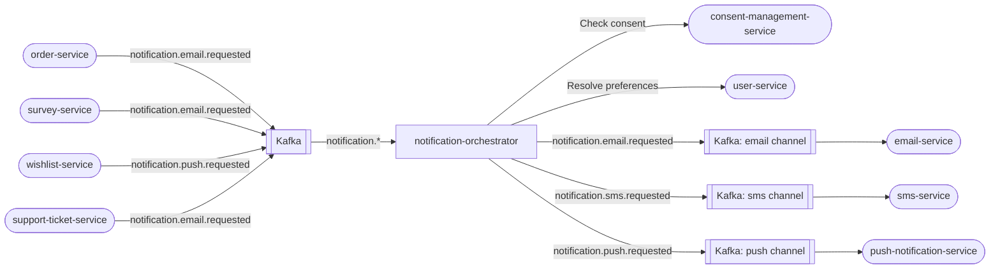

# notification-orchestrator

> Fan-out router that consumes `notification.*` Kafka topics and dispatches to email, SMS, and push channels.

## Overview

The notification-orchestrator is the central routing hub for all outbound notifications in ShopOS. It consumes generic notification request events published by any domain service, resolves the target user's channel preferences and consent status, and re-publishes channel-specific events for the appropriate delivery services. This decouples business domains from the specifics of delivery infrastructure.

## Architecture



## Tech Stack

| Component | Technology |
|---|---|
| Language | Node.js |
| Framework | KafkaJS (consumer + producer) |
| Inter-service calls | gRPC (@grpc/grpc-js) |
| Containerization | Docker |

## Responsibilities

- Consume all `notification.*` Kafka topics using a single consumer group
- Resolve user notification preferences (channels opted in) from `user-service`
- Check marketing consent via `consent-management-service` before sending promotional notifications
- Fan out a single notification request to one or more channel-specific Kafka topics
- Apply per-channel rate limiting to prevent notification flooding
- Support priority levels: `TRANSACTIONAL` (always delivered) and `MARKETING` (consent-gated)
- Dead-letter unroutable or undeliverable notification events

## API / Interface

This service has no gRPC or HTTP API — it operates exclusively as a Kafka consumer/producer.

## Kafka Topics

| Topic | Direction | Description |
|---|---|---|
| `notification.email.requested` | Consumes | Inbound generic email notification request |
| `notification.sms.requested` | Consumes | Inbound generic SMS notification request |
| `notification.push.requested` | Consumes | Inbound generic push notification request |
| `notification.email.requested` | Publishes | Enriched + consent-validated, forwarded to email-service |
| `notification.sms.requested` | Publishes | Enriched + consent-validated, forwarded to sms-service |
| `notification.push.requested` | Publishes | Enriched + consent-validated, forwarded to push-notification-service |
| `notification.dead_letter` | Publishes | Unroutable or failed notification events |

## Dependencies

Upstream (consumes from)
- All domain services that publish `notification.*` events

Downstream (calls)
- `user-service` — resolves notification channel preferences
- `consent-management-service` — validates marketing consent before fan-out
- `email-service`, `sms-service`, `push-notification-service` — downstream delivery via Kafka

## Environment Variables

| Variable | Default | Description |
|---|---|---|
| `KAFKA_BROKERS` | `localhost:9092` | Comma-separated Kafka broker list |
| `KAFKA_GROUP_ID` | `notification-orchestrator` | Kafka consumer group |
| `USER_SERVICE_ADDR` | `user-service:50061` | gRPC address for preference lookup |
| `CONSENT_SERVICE_ADDR` | `consent-management-service:50127` | gRPC address for consent check |
| `RATE_LIMIT_PER_USER_PER_HOUR` | `20` | Max notifications per user per hour |
| `LOG_LEVEL` | `info` | Logging verbosity |

## Running Locally

```bash
docker-compose up notification-orchestrator
```

## Health Check

`GET /healthz` → `{"status":"ok"}`
