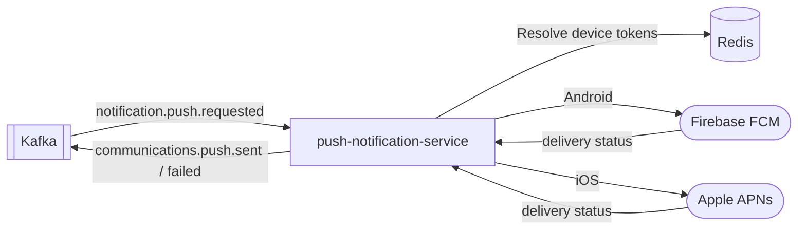

# push-notification-service

> Consumes `notification.push.requested` events and delivers mobile push notifications via FCM and APNs.

## Overview

The push-notification-service is the delivery layer for mobile push notifications in ShopOS. It consumes push request events from Kafka, resolves the target user's registered device tokens, and delivers notifications through Firebase Cloud Messaging (FCM) for Android and Apple Push Notification service (APNs) for iOS. It manages device token registration, expiry, and cleanup.

## Architecture



## Tech Stack

| Component | Technology |
|---|---|
| Language | Go |
| Kafka Consumer | confluent-kafka-go |
| FCM | firebase-admin-go |
| APNs | sideshow/apns2 |
| Token Store | Redis |
| Containerization | Docker |

## Responsibilities

- Consume `notification.push.requested` Kafka events
- Resolve device tokens for the target user from Redis (registered by mobile clients via `RegisterDevice`)
- Fan out to multiple devices per user (user may have multiple devices)
- Route to FCM for Android tokens and APNs for iOS tokens
- Handle token invalidation — remove expired/invalid tokens on provider feedback
- Support notification types: `ALERT`, `DATA`, `SILENT`
- Enforce per-user and per-device rate limits
- Publish delivery result events back to Kafka
- Register and deregister device tokens via gRPC (called by mobile BFF)

## API / Interface

**gRPC service:** (device token management, internal use)

| Method | Request | Response | Description |
|---|---|---|---|
| `RegisterDevice` | `RegisterDeviceRequest` | `Device` | Register a device token for push |
| `DeregisterDevice` | `DeregisterDeviceRequest` | `Empty` | Remove a device token |
| `ListDevices` | `ListDevicesRequest` | `ListDevicesResponse` | List registered devices for a user |

## Kafka Topics

| Topic | Direction | Description |
|---|---|---|
| `notification.push.requested` | Consumes | Inbound push notification request |
| `communications.push.sent` | Publishes | Successful delivery confirmation |
| `communications.push.failed` | Publishes | Delivery failure with error reason |

## Dependencies

**Upstream (consumes from / called by)**
- `notification-orchestrator` — publishes validated push requests via Kafka
- `mobile-bff` — registers/deregisters device tokens via gRPC

**Downstream (calls)**
- Firebase FCM — Android push delivery
- Apple APNs — iOS push delivery

## Environment Variables

| Variable | Default | Description |
|---|---|---|
| `KAFKA_BROKERS` | `localhost:9092` | Comma-separated Kafka broker list |
| `KAFKA_GROUP_ID` | `push-notification-service` | Kafka consumer group |
| `REDIS_ADDR` | `localhost:6379` | Redis address for device token store |
| `REDIS_PASSWORD` | `` | Redis password (empty = no auth) |
| `REDIS_DB` | `3` | Redis database index |
| `FCM_CREDENTIALS_FILE` | `/etc/secrets/fcm.json` | Path to Firebase service account JSON |
| `APNS_CERT_FILE` | `/etc/secrets/apns.p12` | Path to APNs .p12 certificate |
| `APNS_CERT_PASSWORD` | _(secret)_ | APNs certificate password |
| `APNS_BUNDLE_ID` | `com.example.shopos` | iOS application bundle ID |
| `APNS_USE_PRODUCTION` | `false` | `true` for production APNs gateway |
| `TOKEN_TTL_DAYS` | `90` | Days before a device token is considered stale |
| `LOG_LEVEL` | `info` | Logging verbosity |

## Running Locally

```bash
docker-compose up push-notification-service
```

## Health Check

`GET /healthz` → `{"status":"ok"}`
