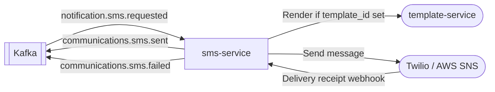

# sms-service

> Consumes `notification.sms.requested` events and delivers SMS messages via Twilio or AWS SNS.

## Overview

The sms-service is the delivery layer for outbound SMS notifications in ShopOS. It consumes SMS request events from Kafka, optionally renders short message templates, and dispatches messages through Twilio or AWS SNS depending on the configured provider. Delivery receipts are tracked and published back to Kafka for observability.

## Architecture



## Tech Stack

| Component | Technology |
|---|---|
| Language | Node.js |
| Framework | KafkaJS (consumer) + Express (webhook) |
| Twilio SDK | twilio |
| AWS SDK | @aws-sdk/client-sns |
| Template Calls | gRPC (@grpc/grpc-js) |
| Containerization | Docker |

## Responsibilities

- Consume `notification.sms.requested` Kafka events
- Validate destination phone numbers (E.164 format)
- Optionally fetch and render an SMS template from `template-service`
- Send SMS via Twilio or AWS SNS (configurable provider)
- Receive and process delivery receipts and failures via inbound webhooks
- Respect opt-out/unsubscribe states — skip delivery for opted-out numbers
- Publish delivery result events back to Kafka
- Enforce per-number rate limits to prevent spam

## API / Interface

This service operates primarily as a Kafka consumer.

Webhook endpoint (inbound HTTP)

| Endpoint | Method | Description |
|---|---|---|
| `/webhooks/twilio` | `POST` | Receives Twilio delivery status callbacks |
| `/webhooks/sns` | `POST` | Receives AWS SNS delivery status notifications |

## Kafka Topics

| Topic | Direction | Description |
|---|---|---|
| `notification.sms.requested` | Consumes | Inbound SMS send request |
| `communications.sms.sent` | Publishes | Confirmation of successful dispatch |
| `communications.sms.failed` | Publishes | Delivery failure with error reason |

## Dependencies

Upstream (consumes from)
- `notification-orchestrator` — publishes validated SMS requests

Downstream (calls)
- `template-service` — optional template fetch/render for SMS body
- Twilio API / AWS SNS — external SMS delivery provider

## Environment Variables

| Variable | Default | Description |
|---|---|---|
| `KAFKA_BROKERS` | `localhost:9092` | Comma-separated Kafka broker list |
| `KAFKA_GROUP_ID` | `sms-service` | Kafka consumer group |
| `TEMPLATE_SERVICE_ADDR` | `template-service:50131` | gRPC address for template rendering |
| `SMS_PROVIDER` | `twilio` | `twilio` or `sns` |
| `TWILIO_ACCOUNT_SID` | _(secret)_ | Twilio Account SID |
| `TWILIO_AUTH_TOKEN` | _(secret)_ | Twilio Auth Token |
| `TWILIO_FROM_NUMBER` | _(secret)_ | Twilio sender phone number |
| `AWS_REGION` | `us-east-1` | AWS region for SNS |
| `AWS_ACCESS_KEY_ID` | _(secret)_ | AWS credentials (or use IAM role) |
| `AWS_SECRET_ACCESS_KEY` | _(secret)_ | AWS credentials (or use IAM role) |
| `WEBHOOK_PORT` | `8095` | HTTP port for delivery receipt webhooks |
| `RATE_LIMIT_PER_NUMBER_PER_HOUR` | `5` | Max SMS per number per hour |
| `LOG_LEVEL` | `info` | Logging verbosity |

## Running Locally

```bash
docker-compose up sms-service
```

## Health Check

`GET /healthz` → `{"status":"ok"}`
