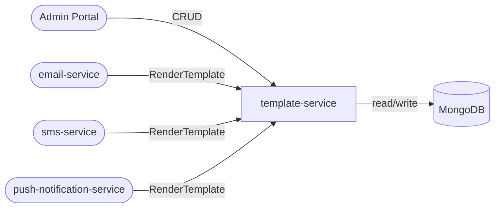

# template-service

> Notification template CRUD with Handlebars and Jinja2 rendering for email, SMS, and push channels.

## Overview

The template-service is the central repository for all notification templates across every channel in ShopOS. Templates are versioned, stored in MongoDB, and support both Handlebars (for Node.js consumers) and Jinja2 syntax (for Python consumers). The service provides both a management API for creating and publishing templates and a render API used at delivery time by the channel services.

## Architecture



## Tech Stack

| Component | Technology |
|---|---|
| Language | Node.js |
| Framework | Express + gRPC (@grpc/grpc-js) |
| Database | MongoDB |
| ODM | Mongoose |
| Handlebars | handlebars |
| Jinja2 (via subprocess) | nunjucks (compatible subset) |
| Containerization | Docker |

## Responsibilities

- Store versioned template definitions with channel type: `EMAIL`, `SMS`, `PUSH`
- Support template variables with a defined schema for validation
- Maintain template lifecycle: `DRAFT` → `PUBLISHED` → `ARCHIVED`
- Render a template by ID against a provided data payload at request time
- Version templates — delivery services always reference a specific version
- Support multi-locale templates (i18n) keyed by `locale` field
- Provide template preview endpoint for admin UI
- Enforce variable substitution — warn on missing required variables

## API / Interface

gRPC service: `TemplateService` (port 50131)

| Method | Request | Response | Description |
|---|---|---|---|
| `CreateTemplate` | `CreateTemplateRequest` | `Template` | Create a new template draft |
| `UpdateTemplate` | `UpdateTemplateRequest` | `Template` | Update a draft template |
| `PublishTemplate` | `PublishTemplateRequest` | `Template` | Make a template version active |
| `GetTemplate` | `GetTemplateRequest` | `Template` | Fetch template definition by ID + version |
| `ListTemplates` | `ListTemplatesRequest` | `ListTemplatesResponse` | List templates with filtering |
| `RenderTemplate` | `RenderTemplateRequest` | `RenderTemplateResponse` | Render a template with supplied data |
| `ArchiveTemplate` | `ArchiveTemplateRequest` | `Template` | Archive an obsolete template version |
| `PreviewTemplate` | `PreviewTemplateRequest` | `PreviewTemplateResponse` | Preview render with sample data |

## Kafka Topics

This service does not produce or consume Kafka topics.

## Dependencies

Upstream (callers)
- `email-service` — renders email templates at delivery time
- `sms-service` — renders SMS body templates
- `push-notification-service` — renders push title/body templates
- `admin-portal` — manages template definitions

Downstream (calls)
- None — this service is a leaf in the call graph

## Environment Variables

| Variable | Default | Description |
|---|---|---|
| `PORT` | `50131` | gRPC server port |
| `MONGODB_URI` | `mongodb://localhost:27017/templates` | MongoDB connection string |
| `DEFAULT_LOCALE` | `en-US` | Fallback locale when requested locale is absent |
| `MAX_TEMPLATE_SIZE_KB` | `256` | Maximum template body size |
| `RENDER_TIMEOUT_MS` | `2000` | Template render timeout |
| `LOG_LEVEL` | `info` | Logging verbosity |

## Running Locally

```bash
docker-compose up template-service
```

## Health Check

`GET /healthz` → `{"status":"ok"}`
