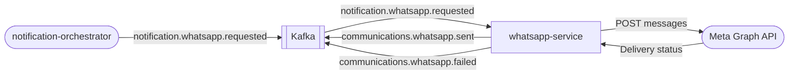

# whatsapp-service

> WhatsApp Business API channel adapter for the ShopOS communications domain.

## Overview

The whatsapp-service is the delivery layer for outbound WhatsApp messages in ShopOS. It consumes `notification.whatsapp.requested` events from Kafka and delivers messages via the Meta WhatsApp Business HTTP API (Cloud API). It is a Kafka-only async service with no gRPC port; a lightweight HTTP server exposes only `/healthz` and stats endpoints.

## Architecture



## Tech Stack

| Component | Technology |
|---|---|
| Language | Node.js 22 |
| Messaging | KafkaJS (consumer/producer) |
| HTTP | Express (healthz + stats) |
| Containerization | Docker (distroless) |

## Responsibilities

- Consume `notification.whatsapp.requested` Kafka events
- Validate destination phone numbers (E.164 format)
- Deliver text, template, and media messages via Meta Graph API v20
- Publish delivery result events back to Kafka
- Expose `/healthz` for liveness probes

## Kafka Topics

| Topic | Direction | Description |
|---|---|---|
| `notification.whatsapp.requested` | Consumes | Inbound WhatsApp send request |
| `communications.whatsapp.sent` | Publishes | Confirmation of successful dispatch |
| `communications.whatsapp.failed` | Publishes | Delivery failure with error reason |

## Environment Variables

| Variable | Default | Description |
|---|---|---|
| `HTTP_PORT` | `3020` | HTTP port for health/stats endpoints |
| `KAFKA_BROKERS` | `localhost:9092` | Comma-separated Kafka broker list |
| `KAFKA_GROUP_ID` | `whatsapp-service` | Kafka consumer group |
| `KAFKA_CLIENT_ID` | `whatsapp-service` | Kafka client identifier |
| `KAFKA_TOPIC` | `notification.whatsapp.requested` | Topic to consume |
| `KAFKA_RETRY_ATTEMPTS` | `8` | Kafka retry attempts |
| `KAFKA_RETRY_INITIAL_TIME` | `300` | Kafka initial retry time (ms) |
| `WHATSAPP_API_URL` | `https://graph.facebook.com/v20.0` | Meta Graph API base URL |
| `WHATSAPP_PHONE_NUMBER_ID` | _(required)_ | Meta phone number ID |
| `WHATSAPP_ACCESS_TOKEN` | _(secret)_ | Meta permanent access token |
| `LOG_LEVEL` | `info` | Logging verbosity |

## Running Locally

```bash
docker-compose up whatsapp-service
```

## Health Check

`GET /healthz` → `{"status":"ok"}`
