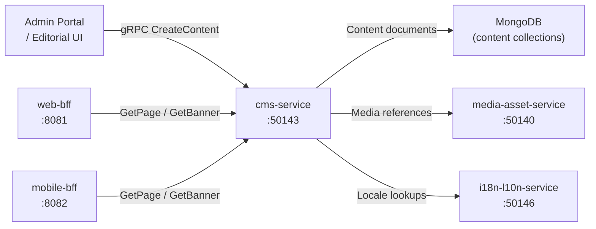

# cms-service

> Headless CMS for managing pages, banners, landing pages, and rich content blocks.

## Overview

The cms-service is the ShopOS headless content management system. It stores and serves structured content — including marketing pages, promotional banners, landing page layouts, and configurable content blocks — in MongoDB. Consumers such as web-bff and mobile-bff retrieve locale-aware content at render time via gRPC, enabling non-engineers to manage storefront copy and layouts without code deployments.

## Architecture



## Tech Stack

| Component | Technology |
|---|---|
| Language | Node.js (Express + gRPC) |
| Database | MongoDB |
| Protocol | gRPC (port 50143) |
| Container Base | node:20-alpine |

## Responsibilities

- Store and version rich content documents (pages, banners, blocks, menus, hero sections)
- Support content scheduling — publish/unpublish at defined timestamps
- Provide locale-aware content retrieval via integration with i18n-l10n-service
- Manage media asset references through media-asset-service
- Support content previews (draft mode) without publishing to live channels
- Serve content with configurable cache TTL hints for BFF caching layers
- Enable A/B test variant content blocks via ab-testing-service metadata flags

## API / Interface

```protobuf
service CmsService {
  rpc GetPage(GetPageRequest) returns (PageContent);
  rpc GetBanner(GetBannerRequest) returns (BannerContent);
  rpc ListContentBlocks(ListContentBlocksRequest) returns (ListContentBlocksResponse);
  rpc CreateContent(CreateContentRequest) returns (ContentDocument);
  rpc UpdateContent(UpdateContentRequest) returns (ContentDocument);
  rpc PublishContent(PublishContentRequest) returns (ContentDocument);
  rpc UnpublishContent(UnpublishContentRequest) returns (ContentDocument);
  rpc DeleteContent(DeleteContentRequest) returns (DeleteContentResponse);
}
```

## Kafka Topics

| Topic | Role |
|---|---|
| `content.page.published` | Emitted when a page or block is published live |
| `content.page.unpublished` | Emitted when content is taken offline |

## Dependencies

Upstream: admin-portal, editorial tooling

Downstream: media-asset-service (asset references), i18n-l10n-service (localization), web-bff, mobile-bff (consumers)

## Environment Variables

| Variable | Default | Description |
|---|---|---|
| `GRPC_PORT` | `50143` | gRPC server port |
| `MONGODB_URI` | — | MongoDB connection string |
| `MONGODB_DB` | `cms` | MongoDB database name |
| `MEDIA_ASSET_SERVICE_ADDR` | `media-asset-service:50140` | Media service address |
| `I18N_SERVICE_ADDR` | `i18n-l10n-service:50146` | Localization service address |
| `DEFAULT_LOCALE` | `en-US` | Fallback locale |
| `DRAFT_MODE_SECRET` | — | Secret token to enable preview/draft mode |

## Running Locally

```bash
docker-compose up cms-service
```

## Health Check

`GET /healthz` → `{"status":"ok"}`
