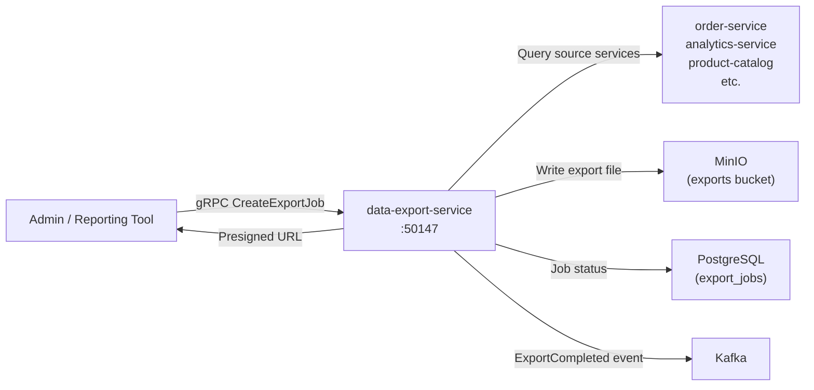

# data-export-service

> Scheduled and on-demand data exports in CSV, JSON, and Parquet formats.

## Overview

The data-export-service provides a unified interface for exporting platform data across multiple domains into common file formats. It supports both scheduled recurring exports and on-demand triggered exports, queuing jobs asynchronously so large dataset exports do not block callers. Completed export files are delivered via presigned MinIO URLs and optionally pushed to downstream consumers via Kafka events.

## Architecture



## Tech Stack

| Component | Technology |
|---|---|
| Language | Python |
| Export Formats | CSV, JSON, Parquet (via PyArrow) |
| Object Storage | MinIO |
| Job Metadata | PostgreSQL |
| Protocol | gRPC (port 50147) |
| Container Base | python:3.12-slim |

## Responsibilities

- Accept export job requests specifying dataset, filters, format, and delivery method
- Execute data collection by querying upstream services or databases via approved interfaces
- Write output files to MinIO in requested format (CSV, JSON, Parquet)
- Track job lifecycle (queued, running, complete, failed) with progress metadata
- Generate presigned download URLs for completed export files
- Support scheduled recurring exports (daily, weekly, custom cron) via integration with scheduler-service
- Enforce data access scopes — exporters only receive data they are authorized for
- Clean up expired export files from MinIO after configurable retention period

## API / Interface

```protobuf
service DataExportService {
  rpc CreateExportJob(CreateExportJobRequest) returns (ExportJob);
  rpc GetExportJobStatus(GetExportJobRequest) returns (ExportJob);
  rpc GetDownloadURL(GetDownloadURLRequest) returns (DownloadURLResponse);
  rpc CancelExportJob(CancelExportJobRequest) returns (ExportJob);
  rpc ListExportJobs(ListExportJobsRequest) returns (ListExportJobsResponse);
  rpc CreateScheduledExport(CreateScheduledExportRequest) returns (ScheduledExport);
  rpc DeleteScheduledExport(DeleteScheduledExportRequest) returns (DeleteResponse);
}
```

## Kafka Topics

| Topic | Role |
|---|---|
| `content.export.completed` | Emitted when an export job finishes successfully |
| `content.export.failed` | Emitted when an export job fails after retries |

## Dependencies

**Upstream:** scheduler-service (scheduled triggers), admin-portal, reporting-service

**Downstream:** MinIO (export file storage), order-service, analytics-service, product-catalog-service (data sources)

## Environment Variables

| Variable | Default | Description |
|---|---|---|
| `GRPC_PORT` | `50147` | gRPC server port |
| `MINIO_ENDPOINT` | `minio:9000` | MinIO endpoint |
| `MINIO_ACCESS_KEY` | — | MinIO access key |
| `MINIO_SECRET_KEY` | — | MinIO secret key |
| `MINIO_EXPORT_BUCKET` | `data-exports` | Bucket for export files |
| `POSTGRES_DSN` | — | PostgreSQL connection string |
| `SCHEDULER_SERVICE_ADDR` | `scheduler-service:50056` | Scheduler service address |
| `KAFKA_BROKERS` | `kafka:9092` | Kafka broker list |
| `EXPORT_FILE_TTL_HOURS` | `72` | Hours before export files are purged |
| `MAX_EXPORT_ROWS` | `5000000` | Maximum rows per export job |
| `WORKER_CONCURRENCY` | `3` | Concurrent export job workers |

## Running Locally

```bash
docker-compose up data-export-service
```

## Health Check

`GET /healthz` → `{"status":"ok"}`
