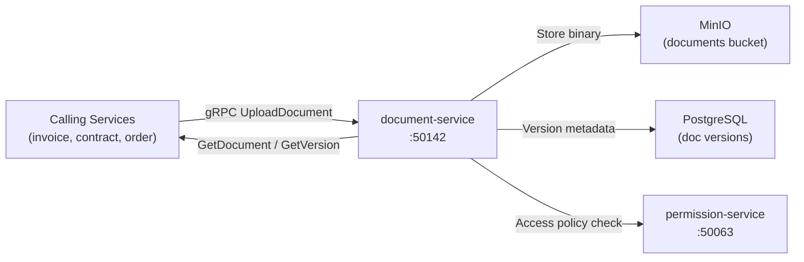

# document-service

> PDF and Word document storage with version control and access control backed by MinIO.

## Overview

The document-service manages the full lifecycle of structured documents such as invoices, contracts, product spec sheets, and export reports within the ShopOS platform. It provides versioned storage in MinIO, metadata indexing in PostgreSQL, and access-controlled retrieval via gRPC. Callers can upload new versions of a document while retaining the full revision history.

## Architecture



## Tech Stack

| Component | Technology |
|---|---|
| Language | Java 21 / Spring Boot 3 |
| Object Storage | MinIO |
| Metadata Store | PostgreSQL |
| DB Migrations | Flyway |
| Protocol | gRPC (port 50142) |
| Container Base | eclipse-temurin:21-jre-alpine |

## Responsibilities

- Accept and store PDF, DOCX, XLSX, and other document formats in MinIO
- Maintain full version history per document with metadata (uploader, timestamp, checksum)
- Enforce access control by delegating permission checks to permission-service
- Generate short-lived presigned download URLs for secure document retrieval
- Support document tagging, categorization, and search by metadata
- Expose document lifecycle operations: archive, restore, permanent delete
- Emit events when documents are created, updated, or deleted

## API / Interface

```protobuf
service DocumentService {
  rpc UploadDocument(stream UploadDocumentRequest) returns (DocumentMetadata);
  rpc GetDocument(GetDocumentRequest) returns (DocumentMetadata);
  rpc GetDocumentVersion(GetDocumentVersionRequest) returns (DocumentMetadata);
  rpc ListVersions(ListVersionsRequest) returns (ListVersionsResponse);
  rpc GetDownloadURL(GetDownloadURLRequest) returns (DownloadURLResponse);
  rpc DeleteDocument(DeleteDocumentRequest) returns (DeleteDocumentResponse);
  rpc ListDocuments(ListDocumentsRequest) returns (ListDocumentsResponse);
}
```

## Kafka Topics

| Topic | Role |
|---|---|
| `content.document.uploaded` | Emitted after a new document or version is stored |
| `content.document.deleted` | Emitted when a document is permanently removed |

## Dependencies

Upstream: invoice-service, contract-service, order-service, data-export-service

Downstream: permission-service (access control), MinIO (storage)

## Environment Variables

| Variable | Default | Description |
|---|---|---|
| `GRPC_PORT` | `50142` | gRPC server port |
| `MINIO_ENDPOINT` | `minio:9000` | MinIO endpoint |
| `MINIO_ACCESS_KEY` | — | MinIO access key |
| `MINIO_SECRET_KEY` | — | MinIO secret key |
| `MINIO_BUCKET` | `documents` | MinIO bucket for documents |
| `SPRING_DATASOURCE_URL` | — | PostgreSQL JDBC URL |
| `SPRING_DATASOURCE_USERNAME` | — | PostgreSQL username |
| `SPRING_DATASOURCE_PASSWORD` | — | PostgreSQL password |
| `PRESIGNED_URL_TTL_SECONDS` | `3600` | Download URL expiry |
| `PERMISSION_SERVICE_ADDR` | `permission-service:50063` | Permission service address |
| `MAX_DOCUMENT_SIZE_MB` | `100` | Maximum document upload size |

## Running Locally

```bash
docker-compose up document-service
```

## Health Check

`GET /healthz` → `{"status":"ok"}`
