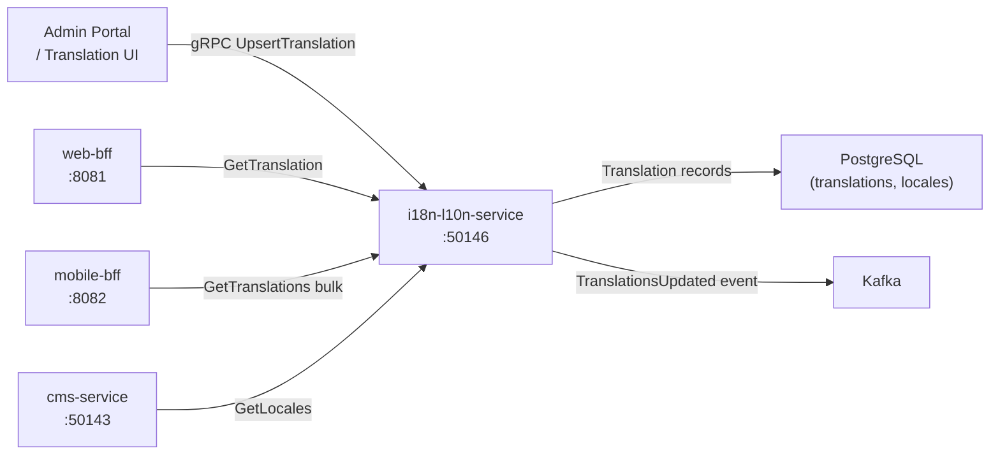

# i18n-l10n-service

> Translation key management, locale configuration, and pluralization rules for the ShopOS platform.

## Overview

The i18n-l10n-service is the single source of truth for all translatable strings, locale configurations, and pluralization rules across the ShopOS platform. Services and BFFs request translated strings by key and locale, enabling a fully internationalized storefront without embedding translations in individual service codebases. It supports ICU message format, currency/date/number formatting rules per locale, and real-time translation updates without service restarts.

## Architecture



## Tech Stack

| Component | Technology |
|---|---|
| Language | Go |
| Database | PostgreSQL |
| DB Migrations | golang-migrate |
| Protocol | gRPC (port 50146) |
| Message Format | ICU Message Format |
| Container Base | gcr.io/distroless/static |

## Responsibilities

- Store and manage translation keys with values per locale
- Support ICU message format for variable interpolation and pluralization
- Manage locale registry (language code, region, currency, date format, text direction)
- Serve bulk translation bundle downloads for client-side use
- Track translation completeness per locale (percentage translated)
- Support fallback locale chains (e.g., `pt-BR` falls back to `pt`, then `en-US`)
- Emit events when translation bundles are updated so BFFs can invalidate caches

## API / Interface

```protobuf
service I18nL10nService {
  rpc GetTranslation(GetTranslationRequest) returns (TranslationResponse);
  rpc GetTranslationBundle(GetBundleRequest) returns (TranslationBundleResponse);
  rpc UpsertTranslation(UpsertTranslationRequest) returns (TranslationEntry);
  rpc DeleteTranslation(DeleteTranslationRequest) returns (DeleteTranslationResponse);
  rpc ListLocales(ListLocalesRequest) returns (ListLocalesResponse);
  rpc GetLocale(GetLocaleRequest) returns (LocaleConfig);
  rpc UpsertLocale(UpsertLocaleRequest) returns (LocaleConfig);
  rpc GetTranslationCoverage(GetCoverageRequest) returns (CoverageResponse);
}
```

## Kafka Topics

| Topic | Role |
|---|---|
| `content.translations.updated` | Emitted when a translation bundle is modified, enabling BFF cache invalidation |

## Dependencies

**Upstream:** admin-portal, translation management tooling

**Downstream:** web-bff, mobile-bff, cms-service, product-catalog-service (all consumers of translations)

## Environment Variables

| Variable | Default | Description |
|---|---|---|
| `GRPC_PORT` | `50146` | gRPC server port |
| `POSTGRES_DSN` | — | PostgreSQL connection string |
| `DEFAULT_LOCALE` | `en-US` | Platform default/fallback locale |
| `FALLBACK_CHAIN_ENABLED` | `true` | Enable locale fallback chaining |
| `KAFKA_BROKERS` | `kafka:9092` | Kafka broker list |
| `BUNDLE_CACHE_TTL_SECONDS` | `300` | In-memory bundle cache TTL |

## Running Locally

```bash
docker-compose up i18n-l10n-service
```

## Health Check

`GET /healthz` → `{"status":"ok"}`
