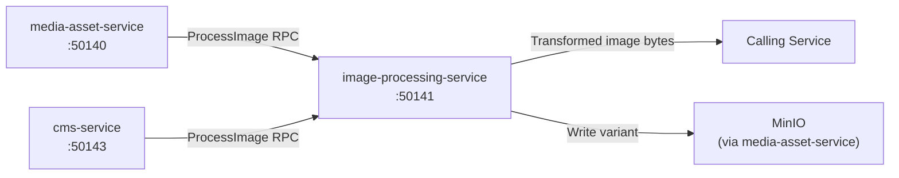

# image-processing-service

> Real-time image transformation service for resize, crop, compress, format conversion, and watermarking.

## Overview

The image-processing-service performs on-demand and batch image manipulation operations for the ShopOS platform. It receives raw image data or asset references and returns transformed variants suitable for web, mobile, and print use cases. All processing is stateless — transformed outputs are handed back to callers or written to MinIO via media-asset-service.

## Architecture



## Tech Stack

| Component | Technology |
|---|---|
| Language | Python |
| Image Library | Pillow / libvips |
| Protocol | gRPC (port 50141) |
| Container Base | python:3.12-slim |

## Responsibilities

- Resize images to arbitrary dimensions or predefined breakpoints (thumbnail, small, medium, large)
- Crop images with configurable anchor points (center, top, focal-point-aware)
- Compress images with quality tuning for JPEG, WebP, and AVIF output
- Convert between formats (JPEG, PNG, WebP, AVIF, GIF)
- Apply text or image watermarks with configurable opacity and placement
- Generate responsive image srcset variants in a single batch call
- Return processed image bytes or a target MinIO path for storage

## API / Interface

```protobuf
service ImageProcessingService {
  rpc ProcessImage(ProcessImageRequest) returns (ProcessImageResponse);
  rpc GenerateVariants(GenerateVariantsRequest) returns (GenerateVariantsResponse);
  rpc ApplyWatermark(WatermarkRequest) returns (WatermarkResponse);
  rpc GetSupportedFormats(Empty) returns (SupportedFormatsResponse);
}
```

## Kafka Topics

This service does not produce or consume Kafka topics. It operates purely via synchronous gRPC.

## Dependencies

Upstream: media-asset-service, cms-service, product-catalog-service

Downstream: None (stateless transformer — returns results to caller)

## Environment Variables

| Variable | Default | Description |
|---|---|---|
| `GRPC_PORT` | `50141` | gRPC server port |
| `MAX_IMAGE_SIZE_MB` | `50` | Maximum input image size |
| `DEFAULT_JPEG_QUALITY` | `85` | Default JPEG compression quality (1–100) |
| `DEFAULT_WEBP_QUALITY` | `80` | Default WebP compression quality |
| `WATERMARK_OPACITY` | `0.3` | Default watermark opacity |
| `WORKER_THREADS` | `4` | Parallel processing threads |

## Running Locally

```bash
docker-compose up image-processing-service
```

## Health Check

`GET /healthz` → `{"status":"ok"}`
