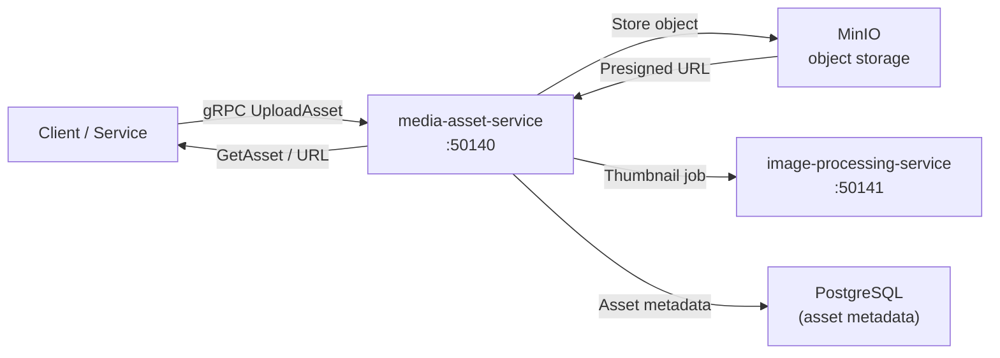

# media-asset-service

> Upload, store, and serve images and media files with automatic thumbnail generation via MinIO.

## Overview

The media-asset-service is the central repository for all binary media assets across the ShopOS platform. It handles upload ingestion, metadata tracking, thumbnail generation, and signed URL delivery for images, videos, and other media files stored in MinIO object storage. Other services reference assets by their stable asset IDs rather than storing raw files themselves.

## Architecture



## Tech Stack

| Component | Technology |
|---|---|
| Language | Go |
| Object Storage | MinIO |
| Metadata Store | PostgreSQL |
| Protocol | gRPC (port 50140) |
| Image Processing | image-processing-service (gRPC) |
| Container Base | gcr.io/distroless/static |

## Responsibilities

- Accept multipart or streaming media uploads via gRPC
- Store raw assets in MinIO under structured bucket/key paths
- Persist asset metadata (type, size, MIME, owner, tags) in PostgreSQL
- Trigger thumbnail/variant generation via image-processing-service
- Generate short-lived presigned download URLs for secure delivery
- Enforce per-tenant storage quotas
- Soft-delete and archive retired assets

## API / Interface

```protobuf
service MediaAssetService {
  rpc UploadAsset(stream UploadAssetRequest) returns (UploadAssetResponse);
  rpc GetAsset(GetAssetRequest) returns (AssetMetadata);
  rpc GetDownloadURL(GetDownloadURLRequest) returns (DownloadURLResponse);
  rpc DeleteAsset(DeleteAssetRequest) returns (DeleteAssetResponse);
  rpc ListAssets(ListAssetsRequest) returns (ListAssetsResponse);
  rpc UpdateAssetTags(UpdateAssetTagsRequest) returns (AssetMetadata);
}
```

## Kafka Topics

| Topic | Role |
|---|---|
| `content.asset.uploaded` | Emitted after a new asset is successfully stored |
| `content.asset.deleted` | Emitted when an asset is soft-deleted |

## Dependencies

Upstream: cms-service, product-catalog-service, video-service (asset references)

Downstream: image-processing-service (thumbnail generation), video-service (video asset storage coordination)

## Environment Variables

| Variable | Default | Description |
|---|---|---|
| `GRPC_PORT` | `50140` | gRPC server port |
| `MINIO_ENDPOINT` | `minio:9000` | MinIO endpoint |
| `MINIO_ACCESS_KEY` | — | MinIO access key |
| `MINIO_SECRET_KEY` | — | MinIO secret key |
| `MINIO_BUCKET` | `media-assets` | Default bucket name |
| `POSTGRES_DSN` | — | PostgreSQL connection string |
| `PRESIGNED_URL_TTL` | `3600` | Presigned URL expiry in seconds |
| `MAX_UPLOAD_SIZE_MB` | `500` | Maximum single upload size |
| `IMAGE_PROCESSING_ADDR` | `image-processing-service:50141` | Downstream processor address |

## Running Locally

```bash
docker-compose up media-asset-service
```

## Health Check

`GET /healthz` → `{"status":"ok"}`
