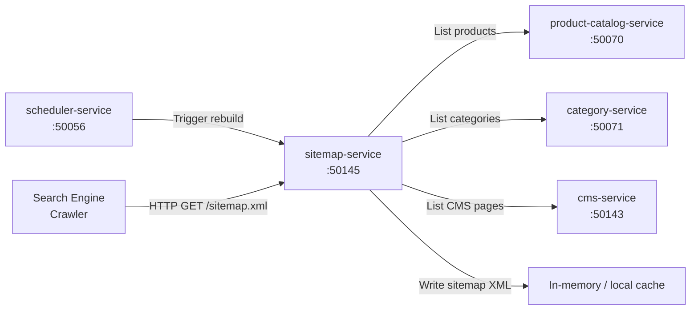

# sitemap-service

> Dynamic sitemap.xml generation derived from the live product and category catalog.

## Overview

The sitemap-service generates standards-compliant XML sitemaps for all publicly accessible storefront URLs by querying the product-catalog-service and category-service at scheduled intervals. It produces sitemap index files with sharded sub-sitemaps to handle large catalogs, and exposes the current sitemap as a downloadable artifact. Sitemaps are refreshed automatically and served with appropriate cache headers to support SEO crawlers.

## Architecture



## Tech Stack

| Component | Technology |
|---|---|
| Language | Go |
| Protocol | gRPC (port 50145) + HTTP (sitemap delivery) |
| Upstream Services | product-catalog-service, category-service, cms-service |
| Container Base | gcr.io/distroless/static |

## Responsibilities

- Crawl product-catalog-service, category-service, and cms-service for all public URLs
- Generate sitemap index XML with sharded sub-sitemaps (50,000 URLs per file limit)
- Include `<lastmod>`, `<changefreq>`, and `<priority>` tags per URL type
- Serve `sitemap.xml` and sub-sitemaps over HTTP with configurable cache TTL
- Support per-locale sitemap generation for multi-language storefronts
- Expose a gRPC endpoint to trigger an immediate on-demand rebuild
- Emit an event when a new sitemap version is published

## API / Interface

```protobuf
service SitemapService {
  rpc TriggerRebuild(TriggerRebuildRequest) returns (RebuildResponse);
  rpc GetSitemapStatus(Empty) returns (SitemapStatusResponse);
  rpc GetSitemapURL(GetSitemapURLRequest) returns (SitemapURLResponse);
}
```

HTTP endpoints:

| Endpoint | Description |
|---|---|
| `GET /sitemap.xml` | Sitemap index file |
| `GET /sitemap-products-{n}.xml` | Product sub-sitemap shard |
| `GET /sitemap-categories.xml` | Category sitemap |
| `GET /sitemap-pages.xml` | CMS pages sitemap |

## Kafka Topics

| Topic | Role |
|---|---|
| `content.sitemap.rebuilt` | Emitted after a successful sitemap regeneration |

## Dependencies

Upstream: scheduler-service (triggers), product-catalog-service, category-service, cms-service

Downstream: None (serves sitemaps directly to crawlers)

## Environment Variables

| Variable | Default | Description |
|---|---|---|
| `GRPC_PORT` | `50145` | gRPC server port |
| `HTTP_PORT` | `8145` | HTTP port for sitemap file delivery |
| `PRODUCT_CATALOG_ADDR` | `product-catalog-service:50070` | Product catalog address |
| `CATEGORY_SERVICE_ADDR` | `category-service:50071` | Category service address |
| `CMS_SERVICE_ADDR` | `cms-service:50143` | CMS service address |
| `REBUILD_INTERVAL_MINUTES` | `60` | Automatic rebuild interval |
| `SITEMAP_BASE_URL` | `https://shop.example.com` | Base URL for sitemap entries |
| `MAX_URLS_PER_SHARD` | `50000` | URLs per sub-sitemap file |
| `CACHE_TTL_SECONDS` | `3600` | HTTP cache TTL for sitemap responses |

## Running Locally

```bash
docker-compose up sitemap-service
```

## Health Check

`GET /healthz` → `{"status":"ok"}`
