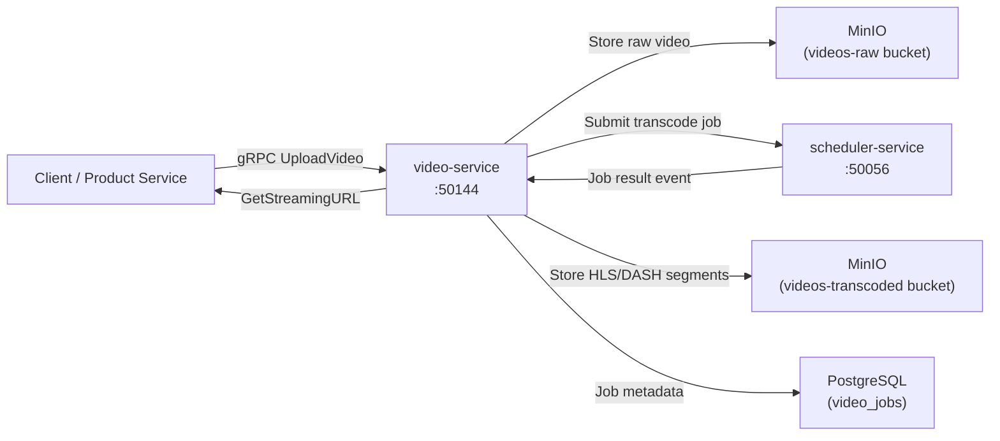

# video-service

> Video upload, transcoding job submission, and streaming URL generation backed by MinIO.

## Overview

The video-service handles the full lifecycle of video assets on the ShopOS platform — from raw upload ingestion through transcoding job orchestration to adaptive streaming URL delivery. Raw uploads are stored in MinIO, transcoding jobs are dispatched asynchronously, and the service tracks job status so callers can poll for completion and retrieve playback-ready streaming URLs.

## Architecture



## Tech Stack

| Component | Technology |
|---|---|
| Language | Go |
| Object Storage | MinIO |
| Metadata Store | PostgreSQL |
| Transcoding Dispatch | scheduler-service (gRPC) |
| Protocol | gRPC (port 50144) |
| Container Base | gcr.io/distroless/static |

## Responsibilities

- Accept streaming video uploads and store raw files in MinIO
- Submit transcoding jobs to scheduler-service for asynchronous FFmpeg-based processing
- Track transcoding job state (pending, processing, complete, failed)
- Generate HLS and DASH manifest URLs from transcoded segments in MinIO
- Generate time-limited presigned URLs for secure playback
- Store video metadata (duration, resolution, codec, bitrate, thumbnail frame)
- Emit events on upload completion and transcoding completion

## API / Interface

```protobuf
service VideoService {
  rpc UploadVideo(stream UploadVideoRequest) returns (VideoMetadata);
  rpc GetVideo(GetVideoRequest) returns (VideoMetadata);
  rpc GetStreamingURL(GetStreamingURLRequest) returns (StreamingURLResponse);
  rpc GetTranscodeStatus(GetTranscodeStatusRequest) returns (TranscodeStatusResponse);
  rpc DeleteVideo(DeleteVideoRequest) returns (DeleteVideoResponse);
  rpc ListVideos(ListVideosRequest) returns (ListVideosResponse);
}
```

## Kafka Topics

| Topic | Role |
|---|---|
| `content.video.uploaded` | Emitted after raw video is stored successfully |
| `content.video.transcoded` | Emitted when transcoding completes (success or failure) |

## Dependencies

Upstream: product-catalog-service, cms-service, media-asset-service

Downstream: scheduler-service (transcoding job dispatch), MinIO (raw and transcoded storage)

## Environment Variables

| Variable | Default | Description |
|---|---|---|
| `GRPC_PORT` | `50144` | gRPC server port |
| `MINIO_ENDPOINT` | `minio:9000` | MinIO endpoint |
| `MINIO_ACCESS_KEY` | — | MinIO access key |
| `MINIO_SECRET_KEY` | — | MinIO secret key |
| `MINIO_RAW_BUCKET` | `videos-raw` | Bucket for raw uploads |
| `MINIO_TRANSCODED_BUCKET` | `videos-transcoded` | Bucket for processed segments |
| `POSTGRES_DSN` | — | PostgreSQL connection string |
| `SCHEDULER_SERVICE_ADDR` | `scheduler-service:50056` | Scheduler service address |
| `STREAMING_URL_TTL` | `86400` | Streaming URL expiry in seconds |
| `MAX_VIDEO_SIZE_GB` | `5` | Maximum upload size in GB |

## Running Locally

```bash
docker-compose up video-service
```

## Health Check

`GET /healthz` → `{"status":"ok"}`
