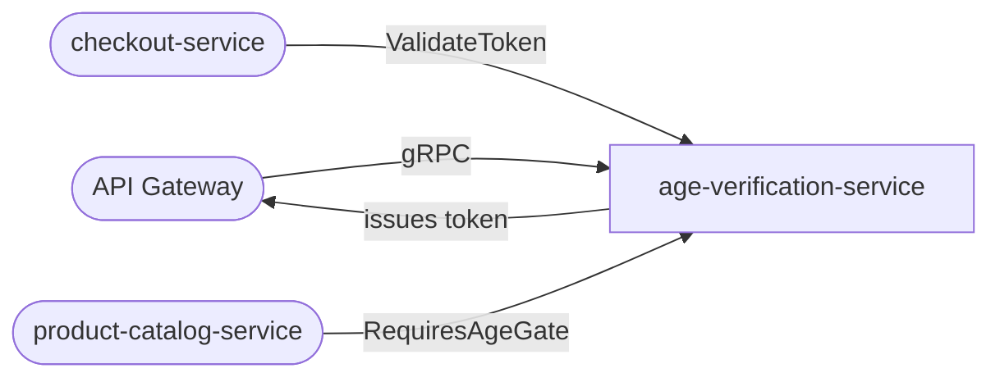

# age-verification-service

> Age gate verification for restricted products such as alcohol, tobacco, and adult content.

## Overview

The age-verification-service enforces age restrictions at checkout and product page access for regulated product categories. It issues short-lived, signed verification tokens upon successful age check so downstream services can validate entitlement without re-querying. The service supports both self-declaration (lightweight) and third-party document verification (strict) modes, configurable per product category.

## Architecture



## Tech Stack

| Component | Technology |
|---|---|
| Language | Go |
| Framework | gRPC (google.golang.org/grpc) |
| Token Signing | JWT (golang-jwt/jwt) |
| Containerization | Docker |

## Responsibilities

- Determine whether a product category requires age verification
- Initiate self-declaration age checks (user asserts date of birth)
- Support integration hooks for third-party ID verification providers (e.g., Yoti, Onfido)
- Issue signed JWT verification tokens with age tier, expiry, and scope
- Validate existing tokens for downstream services (checkout, catalog)
- Track verification results per user to avoid repeated checks within a session
- Enforce minimum age requirements per product category and jurisdiction

## API / Interface

gRPC service: `AgeVerificationService` (port 50128)

| Method | Request | Response | Description |
|---|---|---|---|
| `InitiateVerification` | `InitiateVerificationRequest` | `VerificationSession` | Start an age check for a user |
| `SubmitDeclaration` | `SubmitDeclarationRequest` | `VerificationToken` | Self-declare date of birth |
| `ValidateToken` | `ValidateTokenRequest` | `ValidateTokenResponse` | Verify an age token (used by other services) |
| `GetVerificationStatus` | `GetStatusRequest` | `VerificationStatus` | Check current verification state for a user |
| `RevokeVerification` | `RevokeVerificationRequest` | `Empty` | Invalidate a user's verification (e.g., on fraud) |
| `GetCategoryRequirements` | `GetCategoryRequirementsRequest` | `AgeRequirement` | Get age restrictions for a product category |

## Kafka Topics

_This service does not produce or consume Kafka topics._

## Dependencies

Upstream (callers)
- `api-gateway` — triggers age gate flow before restricted product page access
- `checkout-service` — validates age token before processing orders with restricted items

Downstream (calls)
- `product-catalog-service` — retrieves age restriction metadata for a product category
- External ID verification provider (optional, via HTTP adapter)

## Environment Variables

| Variable | Default | Description |
|---|---|---|
| `PORT` | `50128` | gRPC server port |
| `JWT_SECRET` | _(secret)_ | Secret key for signing verification tokens |
| `TOKEN_TTL_SECONDS` | `3600` | Verification token validity period |
| `DEFAULT_MIN_AGE` | `18` | Default minimum age for restricted products |
| `VERIFICATION_MODE` | `self_declaration` | `self_declaration` or `third_party` |
| `THIRD_PARTY_PROVIDER_URL` | `` | URL for external ID verification provider |
| `THIRD_PARTY_API_KEY` | _(secret)_ | API key for external ID verification |
| `CATALOG_SERVICE_ADDR` | `product-catalog-service:50070` | gRPC address for category metadata |
| `LOG_LEVEL` | `info` | Logging verbosity |

## Running Locally

```bash
docker-compose up age-verification-service
```

## Health Check

`GET /healthz` → `{"status":"ok"}`
