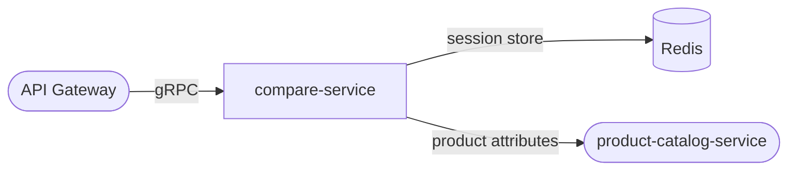

# compare-service

> Side-by-side product comparison for up to 4 products with attribute diff highlighting.

## Overview

The compare-service enables shoppers to add up to four products to a comparison session and view their attributes side by side. Comparison sessions are ephemeral, stored in Redis with a configurable TTL, and keyed by a session or user ID. The service fetches the latest product attributes from the catalog and annotates the response with diff metadata so clients can highlight differences.

## Architecture



## Tech Stack

| Component | Technology |
|---|---|
| Language | Go |
| Framework | gRPC (google.golang.org/grpc) |
| Session Store | Redis |
| Redis Client | go-redis/v9 |
| Containerization | Docker |

## Responsibilities

- Manage compare sessions (create, add, remove, clear)
- Enforce a maximum of 4 products per comparison session
- Fetch up-to-date product attributes from `product-catalog-service` for each session
- Compute an attribute diff matrix and annotate fields that differ across products
- Expire sessions automatically using Redis TTL
- Support anonymous (session-cookie-based) and authenticated (user-ID-based) sessions

## API / Interface

**gRPC service:** `CompareService` (port 50123)

| Method | Request | Response | Description |
|---|---|---|---|
| `CreateSession` | `CreateSessionRequest` | `CompareSession` | Start a new compare session |
| `AddProduct` | `AddProductRequest` | `CompareSession` | Add a product (max 4) |
| `RemoveProduct` | `RemoveProductRequest` | `CompareSession` | Remove a product from session |
| `GetComparison` | `GetComparisonRequest` | `ComparisonResult` | Fetch products with diff annotations |
| `ClearSession` | `ClearSessionRequest` | `Empty` | Remove all products from session |
| `MergeSession` | `MergeSessionRequest` | `CompareSession` | Merge anonymous session into user session on login |

## Kafka Topics

_This service does not produce or consume Kafka topics._

## Dependencies

**Upstream (callers)**
- `api-gateway` — routes compare operations from the storefront

**Downstream (calls)**
- `product-catalog-service` — fetches product attributes and metadata for comparison

## Environment Variables

| Variable | Default | Description |
|---|---|---|
| `PORT` | `50123` | gRPC server port |
| `REDIS_ADDR` | `localhost:6379` | Redis server address |
| `REDIS_PASSWORD` | `` | Redis password (empty = no auth) |
| `REDIS_DB` | `0` | Redis database index |
| `SESSION_TTL_SECONDS` | `86400` | Compare session TTL (default 24 h) |
| `MAX_PRODUCTS_PER_SESSION` | `4` | Maximum products in one comparison |
| `CATALOG_SERVICE_ADDR` | `product-catalog-service:50070` | gRPC address for catalog service |
| `LOG_LEVEL` | `info` | Logging verbosity |

## Running Locally

```bash
docker-compose up compare-service
```

## Health Check

`GET /healthz` → `{"status":"ok"}`
