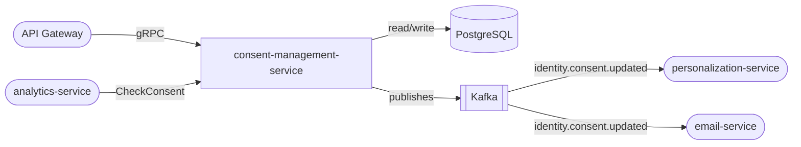

# consent-management-service

> Cookie consent, marketing opt-in/out, and full consent history for GDPR and privacy compliance.

## Overview

The consent-management-service records and enforces user consent preferences across all data processing activities. It maintains an immutable audit log of every consent change, supports granular consent categories (analytics, marketing, personalization), and exposes lookup APIs so other services can gate data processing on current consent status. Consent records are jurisdiction-aware to handle GDPR, CCPA, and other regional regulations.

## Architecture



## Tech Stack

| Component | Technology |
|---|---|
| Language | Node.js |
| Framework | Express + gRPC (@grpc/grpc-js) |
| Database | PostgreSQL |
| ORM | Prisma |
| Message Broker | Kafka (KafkaJS) |
| Containerization | Docker |

## Responsibilities

- Record user consent decisions with timestamp, IP, and jurisdiction
- Maintain an immutable append-only consent event log per user
- Support consent categories: `ANALYTICS`, `MARKETING`, `PERSONALIZATION`, `FUNCTIONAL`
- Provide a `CheckConsent` API for other services to gate processing
- Enforce re-consent flows when privacy policy versions change
- Handle consent withdrawal and downstream propagation via Kafka
- Return full consent history for DSAR (Data Subject Access Requests)

## API / Interface

gRPC service: `ConsentManagementService` (port 50127)

| Method | Request | Response | Description |
|---|---|---|---|
| `RecordConsent` | `RecordConsentRequest` | `ConsentRecord` | Record a consent decision |
| `WithdrawConsent` | `WithdrawConsentRequest` | `ConsentRecord` | Withdraw consent for a category |
| `CheckConsent` | `CheckConsentRequest` | `CheckConsentResponse` | Check if consent is active for a user+category |
| `GetConsentHistory` | `GetConsentHistoryRequest` | `ConsentHistoryResponse` | Full audit log for a user |
| `GetCurrentConsents` | `GetCurrentConsentsRequest` | `CurrentConsentsResponse` | All active consent states for a user |
| `BulkCheckConsent` | `BulkCheckConsentRequest` | `BulkCheckConsentResponse` | Batch consent check for multiple users |

## Kafka Topics

| Topic | Direction | Description |
|---|---|---|
| `identity.consent.updated` | Publishes | Fired on any consent change (grant or withdrawal) |
| `identity.consent.withdrawn` | Publishes | Specifically fired on withdrawal for downstream cleanup |

## Dependencies

Upstream (callers)
- `api-gateway` — surfaces consent preference centre to users
- `analytics-service`, `personalization-service`, `email-service` — check consent before processing

Downstream (calls)
- `gdpr-service` — coordinates with GDPR service for DSAR responses
- `user-service` — resolves user identity and jurisdiction

## Environment Variables

| Variable | Default | Description |
|---|---|---|
| `PORT` | `50127` | gRPC server port |
| `DATABASE_URL` | `postgresql://localhost:5432/consent` | PostgreSQL connection string |
| `KAFKA_BROKERS` | `localhost:9092` | Comma-separated Kafka broker list |
| `KAFKA_GROUP_ID` | `consent-management-service` | Kafka consumer group |
| `DEFAULT_JURISDICTION` | `GDPR` | Default regulatory framework |
| `CONSENT_VERSION` | `1.0` | Current privacy policy version requiring (re)consent |
| `LOG_LEVEL` | `info` | Logging verbosity |

## Running Locally

```bash
docker-compose up consent-management-service
```

## Health Check

`GET /healthz` → `{"status":"ok"}`
