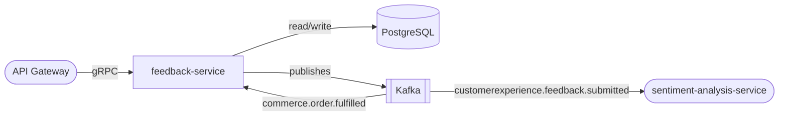

# feedback-service

> Post-purchase feedback collection with automated sentiment tagging.

## Overview

The feedback-service captures short-form feedback from customers after a purchase or interaction and applies automated sentiment analysis to tag each submission as positive, neutral, or negative. It is lighter-weight than the survey-service — designed for quick thumbs-up/down or 1–5 star feedback flows with an optional comment field. Sentiment tags feed into analytics dashboards for product and operations teams.

## Architecture



## Tech Stack

| Component | Technology |
|---|---|
| Language | Node.js |
| Framework | Express + gRPC (@grpc/grpc-js) |
| Database | PostgreSQL |
| ORM | Prisma |
| Message Broker | Kafka (KafkaJS) |
| Containerization | Docker |

## Responsibilities

- Collect post-purchase feedback (rating + optional comment) linked to an order or product
- Publish feedback events to Kafka for downstream sentiment analysis
- Store sentiment tags returned by `sentiment-analysis-service`
- Enforce one feedback submission per user per order
- Expose aggregated feedback metrics (average rating, sentiment breakdown) per product
- Support feedback moderation flagging for inappropriate content
- Trigger thank-you notification on feedback submission

## API / Interface

gRPC service: `FeedbackService` (port 50182)

| Method | Request | Response | Description |
|---|---|---|---|
| `SubmitFeedback` | `SubmitFeedbackRequest` | `Feedback` | Submit post-purchase feedback |
| `GetFeedback` | `GetFeedbackRequest` | `Feedback` | Fetch a single feedback record |
| `ListFeedback` | `ListFeedbackRequest` | `ListFeedbackResponse` | Paginated feedback for a product or order |
| `UpdateSentiment` | `UpdateSentimentRequest` | `Feedback` | Attach sentiment tag (called by analytics) |
| `FlagFeedback` | `FlagFeedbackRequest` | `Feedback` | Flag for moderation review |
| `GetFeedbackSummary` | `GetSummaryRequest` | `FeedbackSummary` | Aggregate stats per product |

## Kafka Topics

| Topic | Direction | Description |
|---|---|---|
| `commerce.order.fulfilled` | Consumes | Triggers feedback invitation after delivery |
| `customerexperience.feedback.submitted` | Publishes | Fired on new submission — consumed by sentiment service |
| `notification.email.requested` | Publishes | Sends thank-you email after feedback |

## Dependencies

Upstream (callers)
- `api-gateway` — customer-facing feedback submission
- `admin-portal` — moderation and analytics views

Downstream (calls / consumes)
- `sentiment-analysis-service` — receives `feedback.submitted` events and posts back sentiment tags
- `order-service` — validates order ownership before accepting feedback
- `notification-orchestrator` / Kafka — sends thank-you notifications

## Environment Variables

| Variable | Default | Description |
|---|---|---|
| `PORT` | `50182` | gRPC server port |
| `DATABASE_URL` | `postgresql://localhost:5432/feedback` | PostgreSQL connection string |
| `KAFKA_BROKERS` | `localhost:9092` | Comma-separated Kafka broker list |
| `KAFKA_GROUP_ID` | `feedback-service` | Kafka consumer group |
| `ORDER_SERVICE_ADDR` | `order-service:50082` | gRPC address for order validation |
| `FEEDBACK_WINDOW_DAYS` | `30` | Days after fulfilment to accept feedback |
| `LOG_LEVEL` | `info` | Logging verbosity |

## Running Locally

```bash
docker-compose up feedback-service
```

## Health Check

`GET /healthz` → `{"status":"ok"}`
