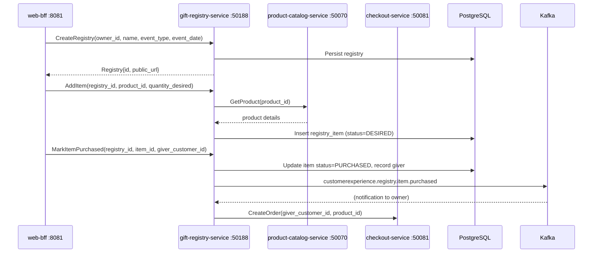

# gift-registry-service

> Manages wishlists and gift registries (wedding, baby shower), tracking purchased items and notifying the registry owner.

## Overview

The gift-registry-service allows customers to create named registries for life events such as weddings, baby showers, or birthdays, and populate them with desired products from the catalog. Gift-givers can browse a public registry URL and mark items as purchased, preventing duplicate gifts. When an item is purchased, the service records the gift-giver's contribution and emits a notification event so the registry owner is informed. All registry and item state is persisted in PostgreSQL for durability and auditability.

## Architecture



## Tech Stack

| Component | Technology |
|---|---|
| Language | Go 1.24 |
| Database | PostgreSQL 16 |
| Migrations | golang-migrate |
| Messaging | Apache Kafka |
| Protocol | gRPC (port 50188) |
| Health Check | HTTP /healthz |

## Key Responsibilities

- Create and manage named gift registries with event type, date, and owner
- Add, update, and remove products from a registry with a desired quantity
- Track partial fulfilment when multiple units of an item are desired
- Allow gift-givers to claim items and mark them purchased to prevent duplicate gifts
- Record gift-giver attribution per purchased item for thank-you tracking
- Generate and resolve public registry share links for gift-giver access
- Publish `customerexperience.registry.item.purchased` Kafka events to notify the registry owner
- Provide registry completion metrics (items desired vs purchased) for progress views

## Environment Variables

| Variable | Default | Description |
|---|---|---|
| `GRPC_PORT` | `50188` | gRPC listen port |
| `DATABASE_URL` | — | PostgreSQL connection string |

## Running Locally

```bash
docker-compose up gift-registry-service
```

## Health Check

`GET /healthz` → `{"status":"ok"}`

gRPC health: `grpc.health.v1.Health/Check` → `SERVING`
