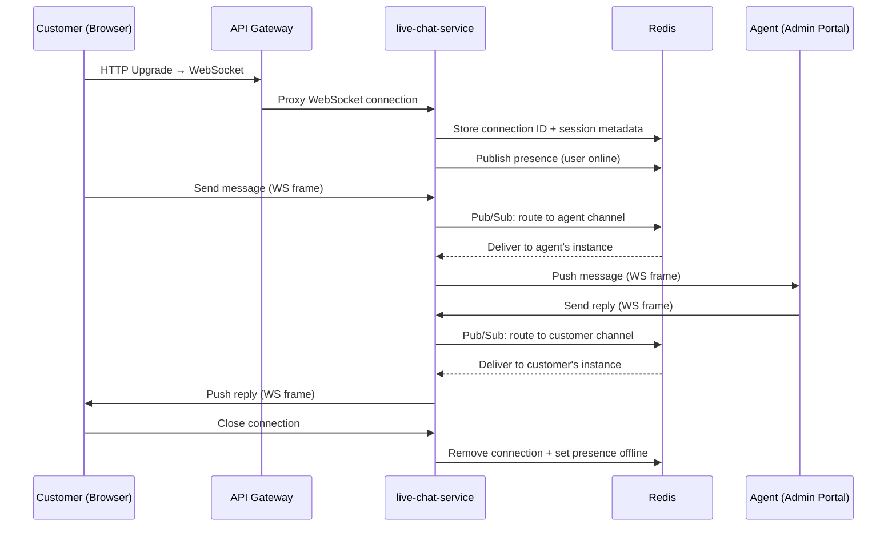

# live-chat-service

> Real-time customer-to-agent chat over WebSocket with presence tracking stored in Redis.

## Overview

The live-chat-service handles real-time bidirectional messaging between customers and support agents using WebSocket connections. Connection state and agent availability are tracked in Redis, enabling horizontal scaling across multiple service instances. Chat sessions can be escalated to a support ticket, and transcripts are persisted for audit purposes.

## Architecture



## Tech Stack

| Component | Technology |
|---|---|
| Language | Go |
| WebSocket | gorilla/websocket |
| gRPC | google.golang.org/grpc |
| Session / Presence Store | Redis |
| Redis Client | go-redis/v9 (pub/sub) |
| Containerization | Docker |

## Responsibilities

- Upgrade HTTP connections to WebSocket and manage their lifecycle
- Authenticate connections via JWT token passed in the handshake
- Route messages between customer and agent using Redis pub/sub channels
- Track online/offline presence of customers and agents in Redis
- Assign an available agent to an incoming chat session (round-robin)
- Persist chat transcripts to Redis with TTL for later audit
- Support typing indicators and read receipts
- Allow escalation of a chat session to a support ticket via gRPC

## API / Interface

**WebSocket endpoint:** `ws://<host>/chat` (upgrade from HTTP on port 50126)

**gRPC service:** `LiveChatService` (port 50126)

| Method | Request | Response | Description |
|---|---|---|---|
| `GetSession` | `GetSessionRequest` | `ChatSession` | Fetch metadata for an active session |
| `ListActiveSessions` | `ListActiveSessionsRequest` | `ListActiveSessionsResponse` | Agent view of ongoing chats |
| `EscalateToTicket` | `EscalateRequest` | `TicketReference` | Convert chat to a support ticket |
| `EndSession` | `EndSessionRequest` | `Empty` | Force-close a chat session |

## Kafka Topics

| Topic | Direction | Description |
|---|---|---|
| `customerexperience.chat.started` | Publishes | Fired when a new chat session opens |
| `customerexperience.chat.ended` | Publishes | Fired when a session is closed |

## Dependencies

**Upstream (callers)**
- `api-gateway` — proxies WebSocket upgrades from the storefront

**Downstream (calls)**
- `support-ticket-service` — creates a ticket from a chat transcript on escalation
- `auth-service` — validates JWT tokens during WebSocket handshake
- `user-service` — resolves user profile for the session context

## Environment Variables

| Variable | Default | Description |
|---|---|---|
| `PORT` | `50126` | WebSocket + gRPC server port |
| `REDIS_ADDR` | `localhost:6379` | Redis server address |
| `REDIS_PASSWORD` | `` | Redis password (empty = no auth) |
| `REDIS_DB` | `2` | Redis database index |
| `SESSION_TTL_SECONDS` | `3600` | Inactivity timeout for chat sessions |
| `TRANSCRIPT_TTL_SECONDS` | `2592000` | Transcript retention in Redis (30 days) |
| `AUTH_SERVICE_ADDR` | `auth-service:50060` | gRPC address for token validation |
| `SUPPORT_TICKET_SERVICE_ADDR` | `support-ticket-service:50125` | gRPC address for ticket escalation |
| `MAX_MESSAGE_SIZE_BYTES` | `4096` | Maximum WebSocket message size |
| `KAFKA_BROKERS` | `localhost:9092` | Comma-separated Kafka broker list |
| `LOG_LEVEL` | `info` | Logging verbosity |

## Running Locally

```bash
docker-compose up live-chat-service
```

## Health Check

`GET /healthz` → `{"status":"ok"}`
