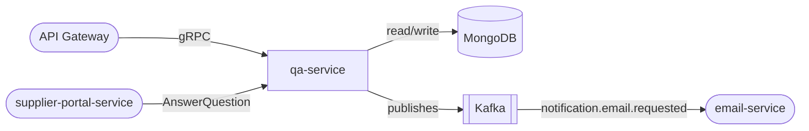

# qa-service

> Product question-and-answer board with upvoting and a structured seller-answer workflow.

## Overview

The qa-service powers the Q&A section on product detail pages, allowing shoppers to post questions and sellers or community members to provide answers. Questions and answers can be upvoted to surface the most helpful content. The service notifies sellers of new unanswered questions and tracks answer status through a workflow state machine.

## Architecture



## Tech Stack

| Component | Technology |
|---|---|
| Language | Node.js |
| Framework | Express + gRPC (@grpc/grpc-js) |
| Database | MongoDB |
| ODM | Mongoose |
| Message Broker | Kafka (KafkaJS) |
| Containerization | Docker |

## Responsibilities

- Accept and persist shopper questions linked to a product SKU
- Manage answer submissions from sellers and community members
- Track question status: `OPEN`, `ANSWERED`, `CLOSED`
- Support upvoting of both questions and answers
- Notify sellers via Kafka when a new question awaits an answer
- Enforce content moderation rules (spam filtering, profanity check hooks)
- Return paginated, relevance-ranked Q&A per product

## API / Interface

**gRPC service:** `QAService` (port 50121)

| Method | Request | Response | Description |
|---|---|---|---|
| `PostQuestion` | `PostQuestionRequest` | `Question` | Submit a new product question |
| `PostAnswer` | `PostAnswerRequest` | `Answer` | Submit an answer to a question |
| `ListQuestions` | `ListQuestionsRequest` | `ListQuestionsResponse` | Paginated questions for a product |
| `GetQuestion` | `GetQuestionRequest` | `Question` | Fetch a single question with answers |
| `VoteQuestion` | `VoteRequest` | `VoteResponse` | Upvote or downvote a question |
| `VoteAnswer` | `VoteRequest` | `VoteResponse` | Upvote or downvote an answer |
| `CloseQuestion` | `CloseQuestionRequest` | `Question` | Mark question as closed |

## Kafka Topics

| Topic | Direction | Description |
|---|---|---|
| `customerexperience.question.asked` | Publishes | Fired when a new question is posted |
| `notification.email.requested` | Publishes | Triggers seller email notification |
| `customerexperience.answer.posted` | Publishes | Fired when an answer is submitted |

## Dependencies

**Upstream (callers)**
- `api-gateway` — routes Q&A read/write requests
- `supplier-portal-service` — sellers submit answers

**Downstream (calls)**
- `notification-orchestrator` / Kafka — sends question-pending emails to sellers
- `product-catalog-service` — validates product SKU existence

## Environment Variables

| Variable | Default | Description |
|---|---|---|
| `PORT` | `50121` | gRPC server port |
| `MONGODB_URI` | `mongodb://localhost:27017/qa` | MongoDB connection string |
| `KAFKA_BROKERS` | `localhost:9092` | Comma-separated Kafka broker list |
| `KAFKA_GROUP_ID` | `qa-service` | Kafka consumer group |
| `CATALOG_SERVICE_ADDR` | `product-catalog-service:50070` | gRPC address for catalog validation |
| `MAX_ANSWERS_PER_QUESTION` | `20` | Cap on answers per question |
| `LOG_LEVEL` | `info` | Logging verbosity |

## Running Locally

```bash
docker-compose up qa-service
```

## Health Check

`GET /healthz` → `{"status":"ok"}`
