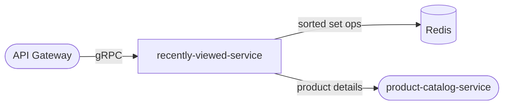

# recently-viewed-service

> Tracks recently viewed products per user using a capped ring buffer in Redis.

## Overview

The recently-viewed-service records product page views and maintains a per-user ordered list of the most recently viewed products, capped at a configurable maximum. The list is stored as a Redis sorted set (score = timestamp), which gives O(log N) inserts and automatic eviction of the oldest entry when the cap is exceeded. The service is read-heavy and optimized for sub-millisecond latency on the storefront.

## Architecture



## Tech Stack

| Component | Technology |
|---|---|
| Language | Go |
| Framework | gRPC (google.golang.org/grpc) |
| Data Store | Redis (sorted sets) |
| Redis Client | go-redis/v9 |
| Containerization | Docker |

## Responsibilities

- Record a product view event for a user (upsert with current timestamp as score)
- Maintain a capped ring buffer per user — evict oldest entry when cap is hit
- Return an ordered list of recently viewed product IDs (most recent first)
- Optionally enrich product IDs with catalog metadata on request
- Support clearing the history for a user (GDPR / user preference)
- Handle anonymous users keyed by session ID

## API / Interface

gRPC service: `RecentlyViewedService` (port 50124)

| Method | Request | Response | Description |
|---|---|---|---|
| `RecordView` | `RecordViewRequest` | `Empty` | Record a product view for a user |
| `GetRecentlyViewed` | `GetRecentlyViewedRequest` | `RecentlyViewedResponse` | Fetch ordered list of product IDs |
| `ClearHistory` | `ClearHistoryRequest` | `Empty` | Delete a user's entire view history |
| `RemoveItem` | `RemoveItemRequest` | `Empty` | Remove a single product from history |

## Kafka Topics

This service does not produce or consume Kafka topics.

## Dependencies

Upstream (callers)
- `api-gateway` — fires `RecordView` on product page loads; fetches list for homepage recommendations widget

Downstream (calls)
- `product-catalog-service` — optionally enriches product IDs with name/image/price when `enrich=true` is requested

## Environment Variables

| Variable | Default | Description |
|---|---|---|
| `PORT` | `50124` | gRPC server port |
| `REDIS_ADDR` | `localhost:6379` | Redis server address |
| `REDIS_PASSWORD` | `` | Redis password (empty = no auth) |
| `REDIS_DB` | `1` | Redis database index |
| `MAX_ITEMS_PER_USER` | `50` | Ring buffer cap per user |
| `KEY_TTL_SECONDS` | `2592000` | Redis key TTL (default 30 days) |
| `CATALOG_SERVICE_ADDR` | `product-catalog-service:50070` | gRPC address for optional enrichment |
| `LOG_LEVEL` | `info` | Logging verbosity |

## Running Locally

```bash
docker-compose up recently-viewed-service
```

## Health Check

`GET /healthz` → `{"status":"ok"}`
