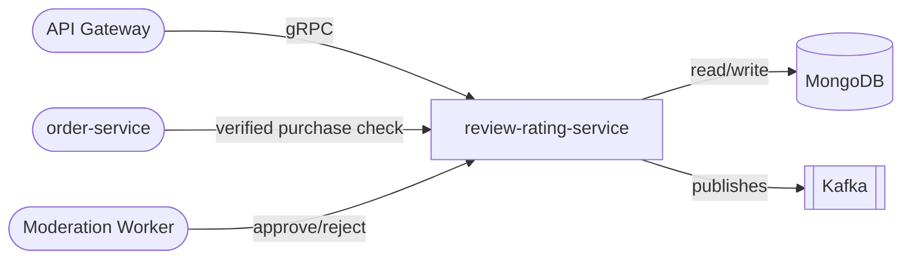

# review-rating-service

> Product reviews, star ratings, moderation queue, and verified purchase badges for the ShopOS catalog.

## Overview

The review-rating-service manages the full lifecycle of customer-submitted product reviews and star ratings. It enforces a moderation workflow before reviews go live and attaches a verified-purchase badge when the reviewer's order history is confirmed. Aggregated rating statistics are computed and cached to serve high-traffic product pages efficiently.

## Architecture



## Tech Stack

| Component | Technology |
|---|---|
| Language | Node.js |
| Framework | Express + gRPC (@grpc/grpc-js) |
| Database | MongoDB |
| ODM | Mongoose |
| Message Broker | Kafka (KafkaJS) |
| Containerization | Docker |

## Responsibilities

- Accept and persist review submissions (text, rating 1–5, media attachments)
- Enforce moderation queue — reviews are `PENDING` until approved or rejected
- Mark reviews with a verified-purchase badge by cross-checking order history
- Compute and store per-product aggregate rating (average, count, histogram)
- Support upvoting/downvoting of reviews for helpfulness ranking
- Emit events when reviews are published or removed

## API / Interface

gRPC service: `ReviewRatingService` (port 50120)

| Method | Request | Response | Description |
|---|---|---|---|
| `SubmitReview` | `SubmitReviewRequest` | `Review` | Submit a new review (enters moderation) |
| `GetReview` | `GetReviewRequest` | `Review` | Fetch a single review by ID |
| `ListReviews` | `ListReviewsRequest` | `ListReviewsResponse` | Paginated reviews for a product |
| `ModerateReview` | `ModerateReviewRequest` | `Review` | Approve or reject a pending review |
| `GetRatingSummary` | `GetRatingSummaryRequest` | `RatingSummary` | Aggregate stats for a product |
| `VoteReview` | `VoteReviewRequest` | `VoteResponse` | Upvote or downvote a review |
| `DeleteReview` | `DeleteReviewRequest` | `Empty` | Soft-delete a review |

## Kafka Topics

| Topic | Direction | Description |
|---|---|---|
| `catalog.review.published` | Publishes | Fired when a review passes moderation |
| `catalog.review.removed` | Publishes | Fired when a review is deleted or rejected |
| `commerce.order.fulfilled` | Consumes | Used to mark reviews as verified purchases |

## Dependencies

Upstream (callers)
- `api-gateway` — routes review submission and listing requests
- `admin-portal` — uses moderation endpoints

Downstream (calls)
- `order-service` — verifies purchase before issuing badge
- `media-asset-service` — stores review images/videos

## Environment Variables

| Variable | Default | Description |
|---|---|---|
| `PORT` | `50120` | gRPC server port |
| `MONGODB_URI` | `mongodb://localhost:27017/reviews` | MongoDB connection string |
| `KAFKA_BROKERS` | `localhost:9092` | Comma-separated Kafka broker list |
| `KAFKA_GROUP_ID` | `review-rating-service` | Kafka consumer group |
| `ORDER_SERVICE_ADDR` | `order-service:50082` | Address for order-service gRPC |
| `MODERATION_AUTO_APPROVE` | `false` | Skip moderation queue (dev only) |
| `MAX_REVIEWS_PER_USER_PER_PRODUCT` | `1` | Limit duplicate reviews |
| `LOG_LEVEL` | `info` | Logging verbosity |

## Running Locally

```bash
docker-compose up review-rating-service
```

## Health Check

`GET /healthz` → `{"status":"ok"}`
